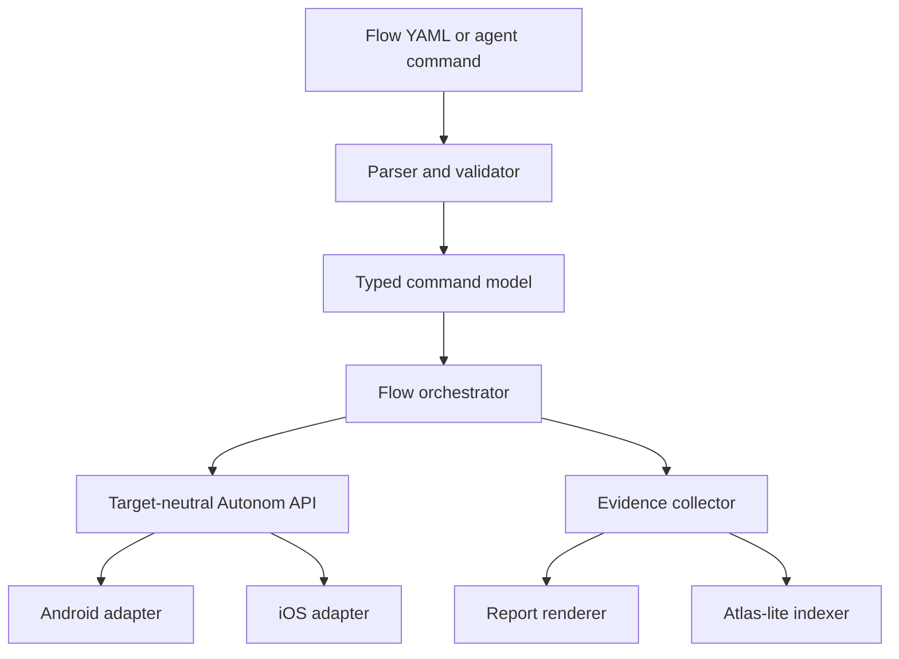

# Autonom: продуктовая и техническая стратегия на основе Revyl и Maestro

**Статус:** рабочая спецификация  
**Дата исследования:** 15 августа 2026 года  
**Текущая версия Autonom:** 0.15.1  
**Цель документа:** определить, что взять из Revyl и Maestro, что не копировать и как превратить Autonom в полезный local-first runtime, test и evidence layer для coding agents.

---

## 1. Короткий вывод

Revyl и Maestro решают разные части одной задачи.

- **Revyl** показывает, как упаковать мобильный runtime в законченный продукт: remote device, AI execution, отчёты, Atlas, Explore и PR proof.
- **Maestro** показывает, как сделать простой и устойчивый Flow DSL: читаемый YAML, автоматические ожидания, selectors, subflows, hooks, tags и CI reports.
- **Autonom** уже имеет сильное техническое ядро: локальное управление Android Emulator и iOS Simulator, общий UI schema, JSON CLI, безопасный MITM, HAR, screenshots, recordings, logs, crashes и переносимые agent skills.

Рекомендуемое направление:

> **Autonom — local-first mobile runtime and evidence layer for coding agents. Он детерминированно управляет приложением, запускает повторяемые flows и сохраняет проверяемые доказательства на инфраструктуре пользователя.**

Autonom не должен становиться маленькой копией Revyl или новой полной реализацией Maestro. Он должен соединить:

1. локальность, прозрачность и безопасность текущего Autonom;
2. простой Flow UX из Maestro;
3. evidence, Atlas-lite и PR proof из Revyl;
4. более строгую семантику, рассчитанную на автономных AI-агентов.

Главный порядок работ:

1. Надёжный CI и test isolation.
2. Autonom Flow v1.
3. Session → Flow compiler.
4. Evidence bundle и HTML/JUnit report.
5. Atlas-lite.
6. PR Proof.
7. Explore.
8. Remote и physical-device adapters.

---

## 2. Что такое Autonom сейчас

[Autonom](https://github.com/aiatsuk/autonom) — универсальный мобильный test и debug harness для AI coding agents.

Текущая поставка:

- 23 переносимых `SKILL.md`-скилла;
- dependency-light Python CLI;
- стабильный machine-readable JSON API;
- поддержка Codex, Claude, Grok и generic skill hosts;
- Android Emulator и iOS Simulator;
- одинаковые основные команды и компактная UI node schema на двух платформах;
- accessibility-first targeting;
- screenshots как доказательства, а не как единственный источник управления;
- отсутствие обязательного MCP и платного vision API.

### 2.1 Уже реализовано

- создание и завершение сессий;
- inventory, boot и shutdown устройств;
- установка, запуск, остановка и очистка приложения;
- UI tree, `find`, semantic tap и coordinate tap;
- ввод текста, keys и swipe;
- screenshots с embedded provenance;
- screenshot index;
- screen recording;
- Android logcat и iOS syslog;
- Android crash buffer и iOS crash store;
- deep links;
- permissions;
- simulated location с платформенными ограничениями;
- media seeding;
- безопасный доступ к app container;
- iOS remote target через `idb companion` на другом Mac;
- Android browser mirror;
- consent-gated HTTP/S interception через mitmproxy;
- response mocking;
- persistent mock rules;
- HAR 1.2 export;
- redaction перед записью;
- process registry и cleanup;
- append-only `journal.ndjson`;
- Flutter, Android/Compose и iOS skill packs.

Подробности: [Capabilities](https://github.com/aiatsuk/autonom/blob/main/docs/CAPABILITIES.md), [Architecture](https://github.com/aiatsuk/autonom/blob/main/docs/ARCHITECTURE.md), [Security](https://github.com/aiatsuk/autonom/blob/main/SECURITY.md).

### 2.2 Пока отсутствует или частично реализовано

- единый Flow DSL;
- replay сессии как теста;
- единый live stream для logs, network и metrics;
- общий CPU, memory, frame и trace report;
- Flutter VM Service integration;
- React Native skill pack;
- XCUITest integration;
- Atlas или экранный граф;
- PR proof;
- полноценный CI release pipeline;
- tagged releases;
- optional MCP wrapper;
- доказанная smoke matrix на реальных simulator/emulator environments.

### 2.3 Результат локальной проверки

Проверен commit `1a0f03d53e5b68a8c5d5fa3c24255b52c2ddf4d9`.

- Validation подтвердил 23 skills.
- Прошли 245 Python tests.
- Прошли 7 Node tests.
- Все shell и syntax checks завершились успешно.

Для успешного запуска потребовалось задать полностью временный `HOME`. Обнаружен test-hygiene bug: `LifecycleBase.tearDown` в `tests/test_devices_lifecycle.py` удаляет `AUTONOM_HOME`, но не восстанавливает предыдущее значение. Последующие тесты переходят на настоящий `~/.autonom`. На read-only home это даёт ложные failures. На обычном developer machine suite может трогать пользовательское состояние.

Это нужно исправить до добавления новых подсистем. Проверка использовала fixtures и fake drivers. Она не доказывает надёжность на настоящих iOS Simulator и Android Emulator.

---

## 3. Что полезного есть в Revyl

[Revyl](https://www.revyl.com/platform/) позиционируется как mobile development platform для coding agents. Это managed cloud product, а не только test runner.

Его полный цикл:

```text
build
  → cloud simulator/emulator
  → interactive dev loop
  → test creation
  → E2E execution
  → evidence report
  → Atlas application map
  → GitHub PR proof
```

### 3.1 Сильные продуктовые решения

#### Один замкнутый цикл

Revyl связывает код, сборку, runtime, тест, evidence и pull request. Пользователь не собирает отдельную систему из Appium, device farm, report portal и CI scripts.

#### Session → Test

Пользователь или агент сначала проходит сценарий на устройстве. Затем Revyl превращает проверенную сессию в сохраняемый тест. Это намного полезнее, чем начинать с пустого YAML-файла.

#### Git-friendly tests

Тесты описываются YAML и хранятся в репозитории. Поддерживаются:

- AI instruction;
- validation;
- extraction;
- manual action;
- Python, JavaScript, TypeScript и Bash steps;
- `if/else`;
- `while`;
- reusable modules;
- variables.

Источники: [Creating tests](https://docs.revyl.com/cli/tests/creating-tests), [YAML format](https://docs.revyl.com/appendix/yaml-test-format), [Step types](https://docs.revyl.com/appendix/step-types).

#### Evidence report

Revyl собирает:

- видео полного запуска;
- timeline действий;
- AI summary и reasoning;
- grounding screenshots и bounds;
- iOS syslog и Android logcat;
- CPU, FPS, RSS, VSS и memory pressure;
- Android Perfetto;
- HTTP и WebSocket waterfall;
- headers, payload и response;
- Copy as cURL;
- shareable report links.

Источник: [Reports](https://docs.revyl.com/tests/reports).

#### Atlas

Atlas строит карту фактически увиденных:

- экранов;
- вариантов экранов;
- состояний;
- переходов;
- покрытых и неизвестных участков.

Важно: Atlas не знает всё приложение. Он знает только наблюдённые пути. Документация признаёт empty maps, processing lag, partial runs и auth blockers.

Источники: [Atlas](https://docs.revyl.com/atlas), [Explore](https://docs.revyl.com/atlas/explore).

#### Explore

Несколько агентов могут параллельно обходить приложение по разным стратегиям:

- balanced;
- surface sweep;
- journey focus;
- hard edges.

Главная идея полезна для Autonom: exploration должен оставлять структурированный граф и воспроизводимый evidence, а не только текстовый отчёт агента.

#### PR Proof

GitHub integration связывает diff, build и runtime verification. Результат включает screenshots и video proof. Это превращает mobile testing в часть code review.

Источник: [GitHub integration](https://docs.revyl.com/integrations/github).

#### Auth и test data как часть продукта

Revyl поддерживает подготовку сессии, variables, secrets и способы выдавать session-scoped tokens. Это важно, потому что OTP, login, seed data и permissions часто блокируют автономный test run раньше, чем UI automation становится полезной.

Источник: [Auth and session prep](https://docs.revyl.com/cli/device/auth-and-session-prep).

### 3.2 Техническая поверхность Revyl

- публичный Go CLI;
- installation через Homebrew, shell script, `pipx`, `uv` и `pip`;
- macOS, Linux и Windows binaries;
- `--json` output;
- Codex, Claude и Cursor skills;
- MCP server;
- cloud builds;
- upload готовых artifacts;
- remote device viewer;
- Expo и React Native hot reload;
- Flutter, native, KMP и Bazel rebuild loop;
- generic CI и GitHub Actions;
- retries и quarantine для flaky tests.

Текущий публичный CLI release на дату исследования: [v0.1.85](https://github.com/RevylAI/revyl-cli/releases/tag/v0.1.85), опубликован 13 августа 2026 года.

### 3.3 Ограничения Revyl

#### Это не physical-device farm

Основная инфраструктура использует iOS Simulator и Android Emulator.

- iOS принимает simulator `.app`;
- `.ipa` не поддерживается;
- Android принимает один `.apk`;
- `.aab`, `.apks` и split APK не поддерживаются.

Источник: [Artifact requirements](https://docs.revyl.com/builds/artifact-requirements).

Следовательно, Revyl не проверяет реальные:

- thermal и battery effects;
- camera hardware;
- carrier network;
- OEM skins;
- Bluetooth и sensor behavior;
- производительность физического устройства.

#### Flutter dev loop слабее React Native

Настоящий hot reload есть для Expo и React Native. Flutter требует rebuild, upload и reinstall. Документация указывает типичный цикл 30–60 секунд.

Источник: [Dev Loop](https://docs.revyl.com/develop/dev-loop-overview).

#### Cloud dependency

AI execution, device backend, reports и Atlas являются SaaS. Полного self-host варианта нет.

#### Privacy и telemetry

CLI telemetry включена по умолчанию. Она может включать CLI/OS/architecture, user и organization IDs, auth/CI/agent metadata, command metadata и sanitized tail ошибки. Отключение выполняется через `REVYL_TELEMETRY_DISABLED=true` или `DO_NOT_TRACK=true`.

Источники: [analytics.go](https://github.com/RevylAI/revyl-cli/blob/main/internal/analytics/analytics.go), [Privacy](https://www.revyl.com/privacy/).

Публичная privacy policy не даёт точных сроков хранения builds, videos, logs и network captures. Она также не раскрывает полный список LLM providers, regions и deletion SLA.

#### Непрозрачная стоимость CI

На дату исследования:

- Trial: 5 часов;
- Solo: $20 в месяц, 1 concurrent device;
- Starter: $250 в месяц, 3 devices;
- Team Pro: $750 в месяц, 10 devices;
- overage: $0.15/min iOS и $0.12/min Android.

Количество включённых Solo minutes не опубликовано. Starter и Team Pro выражены как множители от этого неизвестного объёма.

Источник: [Pricing](https://www.revyl.com/pricing/).

### 3.4 Что взять из Revyl

1. Session → Test.
2. Evidence timeline.
3. Atlas как observed graph.
4. Explore со стратегиями.
5. PR proof, связанный с diff.
6. Auth и test-data preparation.
7. Параллельный запуск и tagged suites.
8. Stability history и quarantine.
9. Один понятный путь от code change до proof.

### 3.5 Что не брать из Revyl

1. Cloud-first архитектуру ядра.
2. Обязательный vision/LLM grounding.
3. Собственную device farm на ранней стадии.
4. Скрытую telemetry по умолчанию.
5. Бессрочные public report links.
6. Непрозрачную usage model.
7. Обещания «no maintenance» и «real devices», которые не совпадают с технической реальностью.

---

## 4. Что полезного есть в Maestro

[Maestro](https://github.com/mobile-dev-inc/Maestro) — Apache 2.0 UI и E2E automation framework для Android, iOS и web. Текущая версия на дату исследования: [CLI 2.8.0](https://github.com/mobile-dev-inc/Maestro/releases/tag/cli-2.8.0).

Maestro особенно полезен как референс для Flow DSL и execution semantics.

### 4.1 Основные идеи Maestro

#### Читаемый YAML

Flow разделён на две части:

1. configuration header;
2. список команд после `---`.

```yaml
appId: com.example.app
name: Login
tags:
  - smoke
env:
  USERNAME: user@example.com
---
- launchApp
- tapOn: Username
- inputText: ${USERNAME}
- tapOn: Login
- assertVisible: Welcome
```

Источник: [Maestro Flows overview](https://github.com/mobile-dev-inc/maestro-docs/blob/main/flows/README.md).

#### Shorthand и expanded form

Простая команда остаётся короткой:

```yaml
- tapOn: Login
```

Точная команда раскрывается в map:

```yaml
- tapOn:
    id: login_button
    enabled: true
```

Это хороший баланс между ручным написанием и machine-generated canonical form.

#### Accessibility-first selectors

Maestro использует accessibility tree и поддерживает:

- `text`;
- `id`;
- `index`;
- `point`;
- state selectors;
- `above`, `below`, `leftOf`, `rightOf`;
- `childOf`, `containsChild`, `containsDescendants`;
- dimensions и traits.

Источники: [Selector guide](https://github.com/mobile-dev-inc/maestro-docs/blob/main/flows/how-to-use-selectors.md), [Core selectors](https://github.com/mobile-dev-inc/maestro-docs/blob/main/api-reference/selectors/core-selectors.md), [Relational selectors](https://github.com/mobile-dev-inc/maestro-docs/blob/main/api-reference/selectors/relational-selectors.md).

#### Assertions являются ожиданиями

`assertVisible` не проверяет состояние один раз. Он опрашивает UI до появления элемента или timeout. В Maestro default составляет до 7 секунд. Для долгих процессов есть `extendedWaitUntil`.

Это важная практика: flow не должен содержать произвольные `sleep`.

Источники: [assertVisible](https://github.com/mobile-dev-inc/maestro-docs/blob/main/api-reference/commands-available/assertvisible.md), [Wait commands](https://github.com/mobile-dev-inc/maestro-docs/blob/main/flows/flow-control-and-logic/wait-commands.md).

#### Atomic nested flows

`runFlow` переиспользует login, onboarding, permissions и другие маленькие сценарии. Он принимает `file`, `env`, inline `commands` и `label`.

Maestro рекомендует держать subflows атомарными и отделять их от end-to-end journeys.

Источники: [Nested flows](https://github.com/mobile-dev-inc/maestro-docs/blob/main/flows/flow-control-and-logic/nested-flows.md), [runFlow](https://github.com/mobile-dev-inc/maestro-docs/blob/main/api-reference/commands-available/runflow.md).

#### Условия без полного языка программирования

Поддерживаются:

- `when.visible`;
- `when.notVisible`;
- `when.platform`;
- `when.true` через JavaScript.

Документация отдельно предупреждает, что чрезмерные conditions делают flow сложным. Для существенно разных сценариев лучше отдельные flows.

Источник: [Conditions](https://github.com/mobile-dev-inc/maestro-docs/blob/main/flows/flow-control-and-logic/conditions.md).

#### Hooks

`onFlowStart` и `onFlowComplete` отделяют setup и cleanup от основного journey. Complete hook выполняется после pass или fail.

Источник: [Hooks](https://github.com/mobile-dev-inc/maestro-docs/blob/main/flows/flow-control-and-logic/hooks.md).

#### Test discovery и tags

`config.yaml` определяет glob patterns, include/exclude tags, execution order и output directory.

Это позволяет хранить:

- `smoke`;
- `critical`;
- `auth`;
- `pull-request`;
- `nightly`;
- `flaky`;
- platform tags.

Источники: [Test discovery and tags](https://github.com/mobile-dev-inc/maestro-docs/blob/main/flows/workspace-management/test-discovery-and-tags.md), [Workspace configuration](https://github.com/mobile-dev-inc/maestro-docs/blob/main/api-reference/workspace-configuration.md).

#### Стандартные отчёты

Maestro выдаёт:

- JUnit XML;
- HTML;
- detailed HTML со steps;
- screenshots;
- recordings;
- logs;
- custom report properties;
- стабильные `junitId` и `junitClassname`.

Источник: [Reports and artifacts](https://github.com/mobile-dev-inc/maestro-docs/blob/main/flows/workspace-management/test-reports-and-artifacts.md).

#### Чистое разделение слоёв

Внутренняя схема Maestro:

```text
YAML Flow
  → YamlCommandReader
  → typed MaestroCommand list
  → Orchestra
  → target-neutral Maestro API
  → Android/iOS/Web driver
```

Эту границу стоит повторить в Autonom: parser и flow engine не должны знать детали `adb`, `simctl` или `idb`.

Источник: [Maestro contributing architecture](https://github.com/mobile-dev-inc/Maestro/blob/main/CONTRIBUTING.md).

### 4.2 Новые практики Maestro 2.7–2.8

Maestro недавно улучшил artifacts:

- flat per-flow bundle;
- structured manifest;
- readable step names;
- screenshot перед каждым step;
- hierarchy на failure;
- device logs;
- crash и ANR reports.

В 2.8 появились дополнительные safety fixes:

- artifact path containment;
- отказ от записи в directory path вместо файла;
- сохранение artifacts при ошибке `onFlowComplete`;
- исправление stale hierarchy в relational selectors;
- точные timestamps и durations в reports.

Источник: [Maestro changelog](https://github.com/mobile-dev-inc/Maestro/blob/main/CHANGELOG.md).

### 4.3 Недостатки Maestro, которые нельзя повторять

#### Regex по умолчанию

`text` и `id` считаются regex. Это удобно, но специальные символы и слишком широкие patterns дают неожиданные matches.

В Autonom default должен быть `exact`. `contains` и `regex` включаются явно.

#### Stateful input

`inputText` вводит текст в текущий focused field. Такой flow зависит от успешности предыдущего tap. Autonom может поддерживать Maestro form, но canonical representation должен уметь фиксировать target.

#### Неявные повторы mutating actions

Maestro имеет `retryTapIfNoChange`. Раньше он использовался шире, но был отключён по умолчанию из-за side effects.

Autonom не должен автоматически повторять tap, type, openLink, permission mutation или network mock mutation.

Источники: [tapOn](https://github.com/mobile-dev-inc/maestro-docs/blob/main/api-reference/commands-available/tapon.md), [Changelog](https://github.com/mobile-dev-inc/Maestro/blob/main/CHANGELOG.md).

#### Retry может скрыть дефект

Maestro ограничивает `maxRetries` значением 3 и называет retry большого flow anti-pattern. Autonom должен применять ещё более строгие правила.

Источник: [retry](https://github.com/mobile-dev-inc/maestro-docs/blob/main/api-reference/commands-available/retry.md).

#### JavaScript слишком расширяет DSL

JS, HTTP requests, loops и expressions превращают YAML в второй язык программирования. Это усложняет determinism, sandboxing, review и secret handling.

Autonom Flow v1 не должен включать общий JavaScript engine.

---

## 5. Итоговое сравнение

| Область | Revyl | Maestro | Autonom сейчас | Цель Autonom |
|---|---|---|---|---|
| Runtime | Cloud | Local или Cloud | Local и remote Mac | Local-first, provider-neutral |
| Devices | Simulator/Emulator | Simulator/Emulator/physical | Simulator/Emulator | Добавить physical adapters |
| Targeting | Vision/LLM + hierarchy | Accessibility selectors | Accessibility JSON | Строгие typed selectors + optional vision |
| Flow DSL | Богатый YAML | Зрелый YAML | Нет | Maestro-inspired strict Flow v1 |
| Replay | Да | Да | Журнал без replay | Session → Flow → Replay |
| Evidence | Очень богатый cloud report | Хороший test bundle | Разрозненные artifacts | Local evidence timeline |
| App graph | Atlas | Нет | Нет | Atlas-lite |
| Exploration | Multi-agent Explore | Нет | Agent может действовать вручную | Structured Explore strategies |
| PR proof | Да | Через CI | Нет | Local/generated PR Proof |
| Privacy | Cloud | Local или Cloud | Local | Local by default, explicit upload |
| Agent portability | Codex/Claude/Cursor | MCP и CLI | Skills для разных agents | Skills + CLI + optional MCP |
| Determinism | Частично model-dependent | Средний | Высокий | Высокий и проверяемый |
| Security | SaaS policy | Framework-level | Explicit consent и redaction | Сохранить и расширить |

---

## 6. Продуктовая позиция Autonom

### 6.1 Основная формулировка

> **Autonom gives coding agents a deterministic mobile runtime, repeatable flows, and local evidence on infrastructure you control.**

Русская версия:

> **Autonom даёт coding agents детерминированный мобильный runtime, повторяемые сценарии и локальные доказательства на инфраструктуре пользователя.**

### 6.2 Для кого

- разработчик мобильного приложения;
- coding agent, который меняет UI или business logic;
- команда, которая не может отправлять artifacts во внешний SaaS;
- Flutter, Android и iOS проекты;
- self-hosted CI;
- remote Mac и локальные device labs;
- разработчики agent tools и IDE integrations.

### 6.3 Главный use case

```text
Agent изменил код
  → собрал приложение
  → запустил на устройстве
  → прошёл пользовательский путь
  → проверил UI, logs, network и performance
  → сохранил flow
  → повторил flow
  → вернул человеку proof
```

### 6.4 Чем Autonom должен отличаться

1. Local-first, а не cloud-first.
2. Accessibility-first, а не vision-first.
3. Exact и typed semantics, а не fuzzy behavior.
4. Agent-portable, а не привязанный к одному IDE.
5. Evidence является частью protocol.
6. Все ошибки machine-readable.
7. Dangerous actions требуют явного intent.
8. Cloud и vision являются adapters, а не core dependency.

---

## 7. Autonom Flow v1

### 7.1 Цели

- человек может прочитать flow без отдельного обучения;
- агент может безопасно сгенерировать flow;
- parser выдаёт точный filename, line, column и error code;
- один flow работает на Android и iOS, если UI semantics совпадают;
- повторный запуск имеет предсказуемую семантику;
- flow сохраняется в Git;
- каждый step связывается с evidence;
- supported Maestro flows можно импортировать;
- новые версии schema не ломают старые flows молча.

### 7.2 Не-цели v1

- общий язык программирования;
- произвольный JavaScript;
- произвольные HTTP calls;
- visual AI как обязательный selector;
- бесконечные loops;
- скрытое восстановление после mutating failures;
- полный parity со всеми командами Maestro;
- orchestration cloud fleet.

### 7.3 Расположение файлов

Рекомендуемая структура:

```text
.autonom/
  config.yaml
  flows/
    auth/
      login.yaml
      logout.yaml
    checkout/
      purchase.yaml
  subflows/
    prepare-session.yaml
    dismiss-permissions.yaml
  baselines/
  schemas/
```

Runtime artifacts не должны попадать в repository:

```text
~/.autonom/sessions/<session-id>/
```

### 7.4 Формат документа

Flow состоит из header и commands, разделённых `---`.

```yaml
schema: autonom.dev/flow/v1
appId: com.example.app
name: Login
tags: [smoke, auth]
---
- launchApp
- assertVisible:
    id: home_screen
```

### 7.5 Header v1

| Поле | Обязательное | Назначение |
|---|---:|---|
| `schema` | Да | Версия контракта |
| `appId` | Да для root flow | Bundle ID или package name |
| `name` | Да | Читаемое имя |
| `id` | Рекомендуется | Стабильный machine ID |
| `description` | Нет | Назначение flow |
| `tags` | Нет | Фильтрация suite |
| `properties` | Нет | CI и test-management metadata |
| `env` | Нет | Несекретные defaults |
| `requires` | Нет | Capabilities и platform constraints |
| `evidence` | Нет | Политика сбора artifacts |
| `onFlowStart` | Нет | Setup commands или subflow |
| `onFlowComplete` | Нет | Cleanup commands или subflow |

Пример capabilities:

```yaml
requires:
  platform: [android, ios]
  capabilities:
    - ui.accessibility
    - logs
    - network.capture
```

Runner должен проверить requirements до первого mutating action.

### 7.6 Команды v1

#### Lifecycle

- `launchApp`
- `stopApp`
- `clearState`
- `openLink`

#### UI actions

- `tapOn`
- `longPressOn`
- `doubleTapOn`
- `inputText`
- `eraseText`
- `pressKey`
- `swipe`
- `scrollUntilVisible`
- `back`

#### Assertions и ожидания

- `assertVisible`
- `assertNotVisible`
- `assertEnabled`
- `assertChecked`
- `waitUntil`
- `waitForIdle`

#### Device state

- `setLocation`
- `setPermissions`
- `setOrientation`
- `addMedia`

#### Composition

- `runFlow`
- `group`
- `retry`

#### Evidence

- `checkpoint`
- `takeScreenshot`
- `note`

Большую часть evidence runner собирает автоматически. Эти команды нужны только для именованных checkpoints и ручных заметок.

### 7.7 Canonical command form

Человек может использовать shorthand:

```yaml
- tapOn: Login
```

`autonom flow fmt` преобразует его в canonical form:

```yaml
- tapOn:
    selector:
      text: Login
      match: exact
    label: Tap Login
```

Canonical form используется:

- Session → Flow compiler;
- machine diffs;
- debugging;
- schema migrations;
- report manifest.

### 7.8 Selectors v1

```yaml
selector:
  text: Continue
  match: exact
  enabled: true
```

Поддерживаемые поля:

- `id`;
- `text`;
- `description`;
- `role`;
- `enabled`;
- `checked`;
- `focused`;
- `selected`;
- `index`;
- `above`;
- `below`;
- `leftOf`;
- `rightOf`;
- `childOf`;
- `containsChild`;
- `bounds` для диагностики;
- `point` как последний fallback.

Match modes:

- `exact` — default;
- `contains`;
- `regex`;
- `caseInsensitiveExact`.

### 7.9 Selector priority

Compiler должен выбирать selector в таком порядке:

1. стабильный accessibility `id`;
2. уникальный visible text;
3. `id + state`;
4. `text + relation`;
5. `role + relation`;
6. explicit `index`;
7. relative point внутри стабильного element;
8. absolute coordinates только с предупреждением.

Autonom сохраняет текущее важное свойство: если selector находит несколько nodes, action не выполняется без явного `index` или уточнения.

### 7.10 Wait semantics

Запрещены скрытые sleeps после каждой команды.

Правила:

- read и assertion commands могут poll UI;
- default assertion timeout задаётся workspace config;
- step может уменьшить или увеличить timeout;
- runner завершает ожидание сразу после выполнения condition;
- timeout является test failure, а не infrastructure error;
- недоступный backend является infrastructure error;
- `waitForIdle` используется только для animation или framework idle;
- долгий backend operation использует `waitUntil` с явным timeout.

Пример:

```yaml
- waitUntil:
    visible:
      id: payment_success
    timeoutMs: 30000
```

### 7.11 Retry semantics

Автоматический retry разрешён для:

- UI tree read;
- screenshots;
- logs read;
- assertion polling;
- временной transport ошибки до начала mutation.

Автоматический retry запрещён для:

- tap;
- double tap;
- input text;
- erase text;
- open link;
- permissions mutation;
- location mutation;
- mock registry mutation;
- payment-like или destructive actions.

Явный retry:

```yaml
- retry:
    maxAttempts: 2
    onlyOn:
      - element_not_ready
    commands:
      - assertVisible:
          id: retryable_status
```

Ограничения:

- максимум 3 attempts;
- no nested retry;
- retry большого root flow запрещён;
- каждый attempt отдельно попадает в journal и report;
- mutating commands требуют `allowMutations: true` и warning.

### 7.12 Conditions

v1 поддерживает только ограниченный набор:

```yaml
- runFlow:
    when:
      platform: android
      visible:
        text: Allow notifications
        match: exact
    file: ../subflows/android-permissions.yaml
```

Допустимы:

- `platform`;
- `visible`;
- `notVisible`;
- `envEquals`;
- логическое AND внутри одного `when`.

Не нужны в v1:

- arbitrary expression;
- `eval`;
- unbounded `while`;
- hidden else branches.

Для существенно разного поведения создаются отдельные flows.

### 7.13 Optional steps

Optional step может использоваться только для внешнего UI, который не определяет успех сценария:

```yaml
- tapOn:
    selector:
      text: Not now
      match: exact
    optional: true
    reason: System prompt may not appear on a reused simulator
```

Требования:

- `reason` обязателен;
- skipped optional step отображается в report;
- optional assertion запрещён;
- optional step не может скрыть crash или transport failure.

### 7.14 Variables и secrets

Несекретные значения могут находиться в header:

```yaml
env:
  LOCALE: en_US
```

Секреты передаются только снаружи:

```bash
autonom flow run login.yaml \
  --secret TEST_EMAIL \
  --secret TEST_PASSWORD
```

Источники secrets:

- process environment;
- stdin descriptor;
- OS keychain adapter;
- CI secret provider;
- будущий plugin interface.

Правила:

- flow не хранит secret value;
- journal хранит имя и длину, но не значение;
- typed text редактируется до записи;
- screenshots и UI tree могут содержать PII, поэтому помечаются sensitive;
- report не становится public автоматически.

### 7.15 Subflows

```yaml
- runFlow:
    file: ../subflows/login.yaml
    label: Authenticate test user
    env:
      USER_ROLE: editor
```

Правила:

- один subflow выполняет одну задачу;
- path разрешается относительно текущего flow;
- path traversal за workspace root запрещён;
- recursion и cycles запрещены;
- root `appId` наследуется;
- subflow может объявить более строгие requirements;
- arguments валидируются до запуска.

### 7.16 Hooks

```yaml
onFlowStart:
  - runFlow: ../subflows/prepare-session.yaml

onFlowComplete:
  - runFlow: ../subflows/cleanup-session.yaml
```

Правила:

- `onFlowComplete` запускается после pass и fail;
- teardown failure не перезаписывает primary failure;
- оба failure сохраняются;
- artifacts сохраняются до cleanup;
- hooks не наследуются рекурсивно subflows;
- workspace policy может запретить mutating teardown.

### 7.17 Evidence policy

```yaml
evidence:
  mode: on-failure
  beforeMutation: true
  afterAssertion: true
  collect:
    - screenshot
    - hierarchy
    - logs
    - crashes
    - network
  bodies: preview
```

Modes:

- `minimal`;
- `on-failure` — recommended default;
- `always`;
- `custom`.

Full network bodies остаются opt-in и требуют существующий Autonom consent.

### 7.18 Полный пример Flow v1

```yaml
schema: autonom.dev/flow/v1
id: auth-login-001
appId: com.example.app
name: Login with email
description: Verify that an existing user can reach the home screen
tags:
  - smoke
  - auth
  - pull-request

properties:
  owner: mobile-platform
  priority: critical

requires:
  platform: [android, ios]
  capabilities:
    - ui.accessibility
    - screenshots
    - logs

evidence:
  mode: always
  beforeMutation: true
  collect:
    - screenshot
    - hierarchy
    - logs
    - crashes

onFlowStart:
  - runFlow: ../../subflows/prepare-session.yaml

onFlowComplete:
  - runFlow: ../../subflows/cleanup-session.yaml

---
- launchApp:
    clearState: true

- tapOn:
    selector:
      text: Sign in
      match: exact
      enabled: true
    label: Open sign in

- tapOn:
    selector:
      id: email
    label: Focus email

- inputText:
    value: ${TEST_EMAIL}
    sensitive: true

- tapOn:
    selector:
      id: password
    label: Focus password

- inputText:
    value: ${TEST_PASSWORD}
    sensitive: true

- tapOn:
    selector:
      text: Continue
      match: exact
      enabled: true
    label: Submit credentials

- assertVisible:
    selector:
      id: home_screen
    timeoutMs: 7000

- checkpoint:
    name: logged-in
```

---

## 8. Session → Flow compiler

Это наиболее выгодная первая продуктовая функция после parser и runner.

### 8.1 Команда

```bash
autonom flow create \
  --from-session s_123 \
  --task login \
  --out .autonom/flows/auth/login.yaml
```

### 8.2 Входные данные

- `journal.ndjson`;
- screenshots index;
- UI tree перед action;
- selected node и bounds;
- platform и target;
- app ID;
- logs и crash state;
- пользовательские notes;
- network checkpoints;
- successful final assertions или выбранные checkpoints.

### 8.3 Compiler pipeline

```text
journal
  → remove diagnostic noise
  → group low-level commands
  → resolve target node
  → choose stable selector
  → detect sensitive input
  → infer assertions from checkpoints
  → extract repeated sequence candidates
  → validate against Flow v1 schema
  → replay on same platform
  → optionally replay cross-platform
  → write canonical YAML
```

### 8.4 Что compiler не должен делать молча

- превращать ambiguous match в `index: 0`;
- сохранять password или token;
- заменять failed action на successful-looking step;
- использовать absolute coordinates без warning;
- считать screenshot похожим без явного visual assertion;
- добавлять retry для mutating action;
- считать flow cross-platform без второго replay.

### 8.5 Quality score

Compiler может вычислять score:

| Фактор | Хорошо | Плохо |
|---|---|---|
| Selector | stable unique ID | absolute point |
| Match | exact | broad regex |
| Input | external secret | literal credential |
| Assertion | semantic state | нет финальной проверки |
| Replay | passed twice | never replayed |
| Platform | verified both | inferred |

Score не заменяет replay. Он только объясняет риск.

---

## 9. Evidence Bundle

Evidence должен быть стабильным локальным protocol, а HTML является только одним renderer.

### 9.1 Структура

```text
~/.autonom/sessions/s_123/
  session.json
  run.json
  journal.ndjson
  manifest.json
  report.html
  report.xml
  video/
    run.mp4
  steps/
    001-launch-app/
      step.json
      before.png
      after.png
      hierarchy-before.json
      hierarchy-after.json
    002-tap-sign-in/
      step.json
      before.png
      target.json
    003-input-email/
      step.json
      before.png
      target.json
  logs/
    device.log
    app.log
  crashes/
    index.json
  network/
    flows.ndjson
    capture.har
  metrics/
    samples.ndjson
    summary.json
  failure/
    error.json
    screenshot.png
    hierarchy.json
    logs.txt
```

### 9.2 `manifest.json`

```json
{
  "schema_version": 1,
  "session_id": "s_123",
  "flow_id": "auth-login-001",
  "status": "failed",
  "platform": "ios",
  "target_id": "...",
  "app_id": "com.example.app",
  "started_at": "2026-08-15T08:00:00Z",
  "finished_at": "2026-08-15T08:00:18Z",
  "primary_error": "assertion_timeout",
  "sensitive": true,
  "artifacts": [],
  "steps": []
}
```

### 9.3 Step record

Каждый step хранит:

- stable step ID;
- source filename, line и column;
- command type;
- canonical arguments после redaction;
- selector;
- matched node ID и bounds;
- start и end timestamps;
- duration;
- attempt number;
- result;
- warning list;
- artifact references;
- precondition и postcondition fingerprints.

### 9.4 Report views

HTML report должен иметь:

1. Summary.
2. Timeline.
3. Step detail.
4. Before/after screenshots.
5. Highlighted target bounds.
6. UI hierarchy diff.
7. Logs around failure.
8. Crash details.
9. Network waterfall.
10. Performance summary.
11. Environment and toolchain snapshot.
12. Reproduction command.

### 9.5 CI formats

- JUnit XML;
- compact JSON summary;
- SARIF только для code-linked findings;
- optional Markdown summary для PR;
- stable exit codes.

---

## 10. Atlas-lite

Atlas-lite — локальный observed graph. Он не должен называться полным source of truth.

### 10.1 Data model

#### Screen

- `screen_id`;
- app ID;
- platform;
- normalized accessibility fingerprint;
- representative screenshot;
- stable labels и IDs;
- variants;
- first и last seen;
- source sessions;
- sensitivity.

#### Transition

- `from_screen_id`;
- `to_screen_id`;
- triggering command;
- selector;
- flow и step ID;
- success count;
- failure count;
- median duration;
- first и last seen.

#### Coverage

- screens observed;
- transitions observed;
- flows covering each node/edge;
- last successful verification;
- stale nodes после UI changes;
- unverified branches.

### 10.2 Fingerprint

Fingerprint не должен зависеть от:

- timestamps;
- counters;
- random IDs;
- list item order, если он не важен;
- keyboard visibility;
- system status bar values.

Он должен учитывать:

- stable IDs;
- roles;
- important visible text classes;
- enabled/selected state;
- hierarchy shape;
- optional coarse layout zones.

### 10.3 Команды

```bash
autonom atlas update --session s_123
autonom atlas show
autonom atlas paths --from login --to checkout
autonom atlas coverage
autonom atlas diff --base main --head HEAD
```

### 10.4 Хранение

```text
~/.autonom/apps/<app-id>/atlas/
  graph.json
  screens/
  transitions/
  coverage.json
```

Repository может хранить только export snapshot:

```bash
autonom atlas export --out .autonom/atlas.json
```

---

## 11. PR Proof

PR Proof связывает code diff и runtime evidence.

### 11.1 Pipeline

```text
git diff
  → detect affected modules/screens/routes
  → map to Atlas nodes and tagged flows
  → select smallest sufficient suite
  → build/install app
  → run flows
  → compare baseline and candidate
  → generate proof bundle
  → emit Markdown + JSON + JUnit
```

### 11.2 Команда

```bash
autonom proof \
  --base main \
  --head HEAD \
  --app build/app.apk \
  --out build/autonom-proof
```

### 11.3 Результат

```text
Status: PASS

Changed areas:
- Authentication form
- Home navigation

Verified:
- auth-login-001 on Android
- auth-login-001 on iOS
- home-navigation-002 on Android

Not covered:
- iOS home-navigation-002

Runtime findings:
- No new crashes
- No new error logs
- 1 new network endpoint
- Home screen median load +180 ms
```

### 11.4 Статусы

- `pass` — все required checks прошли;
- `fail` — есть подтверждённый failure;
- `not_covered` — нет flow или platform coverage;
- `blocked` — build, auth, device или infrastructure issue;
- `inconclusive` — evidence недостаточно.

Нельзя превращать `blocked` или `not_covered` в `pass`.

---

## 12. Explore

Explore запускается только после Flow, Evidence и Atlas-lite.

### 12.1 Стратегии

- `surface` — открыть все доступные controls текущего экрана;
- `journey` — достичь заданной цели;
- `edges` — permissions, offline, invalid inputs, retries и backgrounding;
- `coverage` — пройти неизвестные Atlas edges;
- `change-focused` — исследовать области, затронутые diff;
- `performance` — повторить путь и собрать metrics.

### 12.2 Safety budget

Explore получает явные ограничения:

- maximum actions;
- maximum duration;
- allowed app IDs;
- allowed deep-link schemes;
- forbidden text patterns, например Buy или Delete;
- network capture policy;
- permission mutation policy;
- reset policy;
- allowed routes.

### 12.3 Результат

Explore обязан вернуть:

- новые Atlas nodes и edges;
- journal;
- evidence;
- найденные failures;
- unreached goals;
- generated draft flows;
- warnings о non-deterministic selectors.

---

## 13. Архитектура



### 13.1 Модули

```text
autonom_lib/
  flow/
    schema.py
    parser.py
    canonical.py
    validator.py
    commands.py
    executor.py
    conditions.py
    retry.py
    compiler.py
  evidence/
    manifest.py
    collector.py
    timeline.py
    junit.py
    html.py
  atlas/
    fingerprint.py
    graph.py
    coverage.py
    diff.py
  proof/
    git_diff.py
    selection.py
    runner.py
    summary.py
  adapters/
    android.py
    ios.py
```

### 13.2 Главные границы

- Parser не вызывает device tools.
- Flow executor не формирует HTML.
- Device adapter не знает YAML.
- Evidence collector получает structured events.
- Atlas получает только redacted normalized events.
- Agent skills используют публичный CLI, а не internal modules.
- MCP является wrapper над тем же CLI contract.

### 13.3 Event protocol

Все runtime events должны иметь единую envelope:

```json
{
  "schema_version": 1,
  "event_id": "evt_...",
  "session_id": "s_...",
  "timestamp": "2026-08-15T08:00:00.000Z",
  "kind": "flow.step.finished",
  "platform": "ios",
  "sensitive": false,
  "payload": {}
}
```

Этот protocol питает:

- `journal.ndjson`;
- live follow;
- reports;
- Atlas;
- PR Proof;
- future Runo UI;
- optional MCP.

---

## 14. CLI

### 14.1 Flow

```bash
autonom flow check <file-or-dir>
autonom flow fmt <file-or-dir>
autonom flow explain <file>
autonom flow create --from-session <id> --out <file>
autonom flow run <file-or-dir>
autonom flow list
autonom flow import <maestro-file>
autonom flow export <file> --format maestro
```

### 14.2 Run filters

```bash
autonom flow run .autonom/flows \
  --include-tag smoke \
  --exclude-tag flaky \
  --platform ios \
  --target <udid> \
  --output build/autonom
```

### 14.3 Evidence

```bash
autonom report build <session-id>
autonom report open <session-id>
autonom report export <session-id> --format html
autonom report export <session-id> --format junit
```

### 14.4 Live follow

```bash
autonom follow <session-id>
autonom logs follow
autonom network follow
autonom metrics follow
```

Каждая команда поддерживает `--json`. Human output идёт в stderr или отдельный renderer. JSON stdout остаётся чистым.

---

## 15. Совместимость с Maestro

### 15.1 Рекомендация

Не заявлять полную Maestro compatibility. Поддерживать документированный **Maestro Core Profile**.

### 15.2 Core Profile

Первый профиль:

- header: `appId`, `name`, `tags`, `env`;
- `launchApp`, `stopApp`, `clearState`;
- `tapOn`, `longPressOn`, `inputText`, `eraseText`;
- `swipe`, `back`, `openLink`;
- `assertVisible`, `assertNotVisible`;
- `extendedWaitUntil`;
- `takeScreenshot`;
- `runFlow`;
- basic selectors;
- `when.platform`, `when.visible`, `when.notVisible`.

### 15.3 Import behavior

```bash
autonom flow import maestro.yaml --out autonom.yaml
```

Importer:

- добавляет `schema`;
- делает `match` явным;
- проверяет selector uniqueness при dry run;
- переносит tags и metadata;
- помечает unsupported commands;
- не исполняет файл при неоднозначной конвертации.

Ошибка:

```json
{
  "ok": false,
  "error_code": "unsupported_flow_command",
  "command": "runScript",
  "file": "maestro.yaml",
  "line": 27,
  "hint": "Replace runScript with a deterministic subflow or execute it outside Flow v1"
}
```

### 15.4 Почему не использовать Maestro runtime напрямую

- Java 17 увеличивает installation cost;
- Maestro приносит собственные Android и iOS drivers;
- это дублирует Autonom adapters;
- full semantics слишком широкая;
- Autonom потеряет dependency-light design;
- evidence и security model придётся строить вокруг чужого executor;
- Autonom нужен target-neutral protocol, который работает и вне E2E tests.

---

## 16. Безопасность

Текущая security модель Autonom является преимуществом и не должна размываться.

### 16.1 Обязательные правила

- local-only по умолчанию;
- никакой telemetry без явного opt-in;
- MITM только на loopback;
- physical-device proxy attachment запрещён, пока нет безопасной модели;
- consent нельзя выдать через environment variable;
- full network bodies являются opt-in;
- redaction выполняется до записи;
- CA private key не входит в session artifacts;
- app-container path traversal запрещён;
- artifact paths confined внутри output root;
- flow subpaths confined внутри workspace;
- public sharing отсутствует по умолчанию;
- каждое upload action требует явного destination;
- secrets не попадают в journal, report и command echo;
- screenshot, video, hierarchy и HAR маркируются sensitive.

### 16.2 Новые угрозы от Flow engine

- replay destructive step;
- duplicate tap;
- secret interpolation в report;
- path traversal через `runFlow` и screenshot path;
- recursive subflows;
- unbounded loops;
- cleanup, который удаляет не test data;
- condition, скрывающий failed assertion;
- imported Maestro script с arbitrary JS;
- report, который открывает remote resources;
- HTML injection через UI text или logs.

### 16.3 Меры

- schema validation до execution;
- dry-run capability check;
- typed command risk level;
- mutating command audit;
- no implicit mutation retry;
- output path containment;
- HTML escaping и Content Security Policy;
- no external report assets;
- bounded actions и duration;
- primary и cleanup errors хранятся отдельно;
- imported scripts не выполняются;
- secrets передаются через explicit providers.

---

## 17. План реализации

### Phase 0. Надёжное основание

Задачи:

- исправить восстановление `AUTONOM_HOME` в tests;
- добавить GitHub Actions;
- добавить Python и Node checks;
- добавить macOS и Linux matrix;
- добавить Android emulator smoke;
- добавить iOS simulator smoke на macOS;
- добавить version tags и release artifacts;
- зафиксировать CLI compatibility policy.

Критерии готовности:

- suite не пишет в реальный home;
- все tests проходят в clean environment;
- два последовательных runs не влияют друг на друга;
- Android и iOS smoke запускают приложение и выполняют UI tree + tap + screenshot;
- release воспроизводим из tag.

### Phase 1. Flow v1 foundation

Задачи:

- schema;
- parser;
- canonical model;
- validation errors с line/column;
- basic commands;
- selectors;
- assertions с polling;
- `runFlow`;
- tags;
- `flow check`, `fmt`, `run`;
- JSON event stream.

Критерии готовности:

- один login flow проходит на Android и iOS fixtures;
- unsupported command никогда не игнорируется;
- duplicate selector не вызывает action;
- exact match является default;
- mutating command не повторяется автоматически;
- invalid path блокируется до device action.

### Phase 2. Session → Flow

Задачи:

- journal compiler;
- selector scoring;
- sensitive input extraction;
- checkpoint assertions;
- canonical YAML generation;
- same-platform replay;
- quality explanation.

Критерии готовности:

- успешная ручная login session превращается в flow;
- secrets не появляются в output;
- generated flow проходит два replay runs;
- coordinate fallback явно помечен;
- ambiguous selector блокирует generation или требует выбора.

### Phase 3. Evidence Bundle

Задачи:

- manifest v1;
- per-step artifacts;
- failure snapshot;
- log windows;
- crash collection;
- HAR links;
- metrics summary;
- HTML detailed report;
- JUnit;
- reproduction command.

Критерии готовности:

- любой failed step объясняется без повторного запуска;
- report не требует internet;
- report paths confined;
- teardown failure не удаляет evidence;
- sensitive values redacted;
- CI может открыть JUnit и HTML artifacts.

### Phase 4. Atlas-lite

Задачи:

- screen fingerprint;
- variant detection;
- transition graph;
- coverage index;
- graph export;
- stale node detection;
- path query.

Критерии готовности:

- повторный visit не создаёт duplicate screen;
- значимое UI state создаёт variant;
- каждый edge ссылается на session и evidence;
- пользователь видит observed, stale и uncovered paths;
- Atlas не заявляет ненаблюдаемое покрытым.

### Phase 5. PR Proof

Задачи:

- diff reader;
- changed-area mapping;
- flow selection;
- baseline/candidate comparison;
- Markdown summary;
- JSON и JUnit outputs;
- generic CI example;
- optional GitHub Action.

Критерии готовности:

- `not_covered` не становится `pass`;
- proof содержит точные flow и platform results;
- каждый finding ведёт к evidence;
- infrastructure failure отделён от product failure;
- PR summary укладывается в один экран.

### Phase 6. Explore

Задачи:

- strategy interface;
- action and time budgets;
- forbidden actions;
- Atlas-aware exploration;
- draft flow generation;
- coverage report;
- multiple agents через external orchestrator.

Критерии готовности:

- Explore нельзя вывести за allowed app и budget;
- каждое действие журналируется;
- новые paths воспроизводятся или помечаются non-reproducible;
- generated flow проходит validator;
- destructive UI requires explicit policy.

### Phase 7. Providers

Задачи:

- local adapter contract;
- remote Mac adapter;
- Android host adapter;
- physical device policy;
- third-party cloud adapter interface;
- provider capability negotiation.

Критерии готовности:

- один Flow v1 не меняется при смене provider;
- unsupported capability обнаруживается до run;
- artifacts возвращаются в единый local format;
- cloud upload всегда явный.

---

## 18. Test strategy

### 18.1 Unit tests

- YAML parser;
- schema migrations;
- canonical formatting;
- selector matching;
- ambiguity refusal;
- condition evaluation;
- path containment;
- redaction;
- retry policy;
- screen fingerprint;
- report escaping.

### 18.2 Contract tests

- golden JSON command contract;
- golden Flow v1 schema;
- golden event envelope;
- golden manifest;
- JUnit XSD compatibility;
- stable exit codes;
- v1 flows continue to work after updates.

### 18.3 Integration tests

- fake Android and iOS adapters;
- real Android Emulator;
- real iOS Simulator;
- Flutter semantics;
- Compose IDs;
- UIKit identifiers;
- SwiftUI accessibility;
- deep links;
- permissions;
- network consent;
- crashes;
- Unicode input;
- large UI trees;
- modal hierarchy;
- orientation.

### 18.4 Reliability matrix

Каждый release должен запускать один и тот же smoke suite:

- Android current и previous API;
- iOS current и previous runtime;
- Flutter demo app;
- Compose demo app;
- UIKit или SwiftUI demo app;
- bare host without tools;
- remote iOS host.

### 18.5 Flake measurement

Critical flows запускаются минимум 20 раз в controlled environment.

Считаются:

- pass rate;
- assertion timeout rate;
- selector ambiguity rate;
- transport failure rate;
- median и p95 duration;
- retry count;
- evidence completeness.

---

## 19. Метрики продукта

### North Star

**Verified agent changes:** доля изменений coding agent, для которых Autonom вернул воспроизводимый runtime proof.

### Основные метрики

- time from code change to first device action;
- time from session to generated flow;
- generated flow replay success rate;
- cross-platform replay success rate;
- percent of failures explainable from first evidence bundle;
- selector ambiguity rate;
- coordinate fallback rate;
- artifact completeness rate;
- median report size;
- Atlas screen and transition coverage;
- PR Proof coverage rate;
- infrastructure versus product failure ratio;
- secret leakage incidents — target 0;
- unintended mutating retries — target 0.

### Не использовать как основную метрику

- число AI actions;
- число screenshots;
- число созданных YAML-файлов;
- число Atlas nodes без verified paths;
- pass rate без учёта skipped и not-covered.

---

## 20. Основные риски

| Риск | Последствие | Мера |
|---|---|---|
| Flow DSL становится вторым Maestro | Большая стоимость поддержки | Ограниченный v1 и importer |
| Слишком много AI semantics | Невоспроизводимые tests | Deterministic core, AI optional |
| Evidence быстро разрастается | Disk и privacy проблемы | Policies, retention, preview bodies |
| Atlas создаёт ложное чувство покрытия | Пропущенные paths | Только observed graph и explicit unknown |
| Retry скрывает bugs | False pass | No implicit mutation retry |
| Conditions превращают YAML в код | Сложный debug | Ограниченный `when`, separate flows |
| Secrets попадают в screenshots | Data leak | Sensitive marking, local-only, review tools |
| Physical devices расширяют scope | Замедление core roadmap | Provider adapter после Flow/Evidence |
| Cloud features размывают позицию | Потеря local-first moat | Cloud только как optional provider |
| Compatibility promise с Maestro | Постоянная гонка за parity | Версионированный Core Profile |

---

## 21. Зафиксированные продуктовые решения

1. Autonom остаётся local-first.
2. CLI остаётся source of truth.
3. MCP остаётся optional wrapper.
4. Flow v1 вдохновлён Maestro, но имеет собственную schema.
5. Maestro import поддерживает только явный Core Profile.
6. Exact selector match является default.
7. Duplicate match блокирует action.
8. Mutating commands не повторяются автоматически.
9. Assertions выполняют polling вместо sleeps.
10. JavaScript отсутствует в Flow v1.
11. Evidence собирается как protocol, а не только HTML.
12. Session → Flow является первым главным продуктовым workflow.
13. Atlas-lite хранит только observed graph.
14. PR Proof различает pass, fail, not covered, blocked и inconclusive.
15. Explore появляется только после replay, evidence и Atlas.
16. Cloud и physical devices подключаются через providers.
17. Telemetry отсутствует по умолчанию.
18. Любая внешняя передача artifacts является явным действием.

---

## 22. Итоговая рекомендация

Не нужно конкурировать с Revyl по количеству cloud features и не нужно заново реализовывать весь Maestro.

Нужно построить компактный, строгий и хорошо связанный продуктовый цикл:

```text
Observe
  → Act
  → Verify
  → Save Flow
  → Replay
  → Build Evidence
  → Update Atlas
  → Prove Change
```

Самая сильная версия Autonom выглядит так:

- запускается локально;
- подходит разным coding agents;
- одинаково управляет Android и iOS;
- понимает accessibility tree;
- генерирует короткие читаемые flows;
- не скрывает ambiguity и flakes;
- оставляет полный local evidence;
- показывает, какие части приложения реально проверены;
- связывает code diff с runtime proof;
- при необходимости работает на remote Mac, physical device или cloud provider без изменения flow.

Это не «ещё один mobile test framework». Это **runtime verification layer для автономной разработки мобильных приложений**.

---

## 23. Основные источники

### Autonom

- [Repository](https://github.com/aiatsuk/autonom)
- [Capabilities](https://github.com/aiatsuk/autonom/blob/main/docs/CAPABILITIES.md)
- [Architecture](https://github.com/aiatsuk/autonom/blob/main/docs/ARCHITECTURE.md)
- [Security](https://github.com/aiatsuk/autonom/blob/main/SECURITY.md)

### Revyl

- [Platform](https://www.revyl.com/platform/)
- [Introduction](https://docs.revyl.com/get-started/introduction)
- [CLI](https://docs.revyl.com/cli)
- [CLI command reference](https://docs.revyl.com/cli/command-reference)
- [Dev Loop](https://docs.revyl.com/develop/dev-loop-overview)
- [Creating tests](https://docs.revyl.com/cli/tests/creating-tests)
- [YAML test format](https://docs.revyl.com/appendix/yaml-test-format)
- [Step types](https://docs.revyl.com/appendix/step-types)
- [Reports](https://docs.revyl.com/tests/reports)
- [Atlas](https://docs.revyl.com/atlas)
- [Explore](https://docs.revyl.com/atlas/explore)
- [GitHub integration](https://docs.revyl.com/integrations/github)
- [MCP setup](https://docs.revyl.com/integrations/mcp-setup)
- [Artifact requirements](https://docs.revyl.com/builds/artifact-requirements)
- [Pricing](https://www.revyl.com/pricing/)
- [Privacy](https://www.revyl.com/privacy/)
- [CLI repository](https://github.com/RevylAI/revyl-cli)
- [CLI releases](https://github.com/RevylAI/revyl-cli/releases)

### Maestro

- [Repository](https://github.com/mobile-dev-inc/Maestro)
- [Documentation repository](https://github.com/mobile-dev-inc/maestro-docs)
- [Flows overview](https://github.com/mobile-dev-inc/maestro-docs/blob/main/flows/README.md)
- [Selector guide](https://github.com/mobile-dev-inc/maestro-docs/blob/main/flows/how-to-use-selectors.md)
- [Core selectors](https://github.com/mobile-dev-inc/maestro-docs/blob/main/api-reference/selectors/core-selectors.md)
- [Relational selectors](https://github.com/mobile-dev-inc/maestro-docs/blob/main/api-reference/selectors/relational-selectors.md)
- [Nested flows](https://github.com/mobile-dev-inc/maestro-docs/blob/main/flows/flow-control-and-logic/nested-flows.md)
- [Conditions](https://github.com/mobile-dev-inc/maestro-docs/blob/main/flows/flow-control-and-logic/conditions.md)
- [Hooks](https://github.com/mobile-dev-inc/maestro-docs/blob/main/flows/flow-control-and-logic/hooks.md)
- [Wait commands](https://github.com/mobile-dev-inc/maestro-docs/blob/main/flows/flow-control-and-logic/wait-commands.md)
- [Retry](https://github.com/mobile-dev-inc/maestro-docs/blob/main/api-reference/commands-available/retry.md)
- [Test discovery and tags](https://github.com/mobile-dev-inc/maestro-docs/blob/main/flows/workspace-management/test-discovery-and-tags.md)
- [Reports and artifacts](https://github.com/mobile-dev-inc/maestro-docs/blob/main/flows/workspace-management/test-reports-and-artifacts.md)
- [Workspace configuration](https://github.com/mobile-dev-inc/maestro-docs/blob/main/api-reference/workspace-configuration.md)
- [Architecture notes](https://github.com/mobile-dev-inc/Maestro/blob/main/CONTRIBUTING.md)
- [Changelog](https://github.com/mobile-dev-inc/Maestro/blob/main/CHANGELOG.md)
- [CLI releases](https://github.com/mobile-dev-inc/Maestro/releases)
