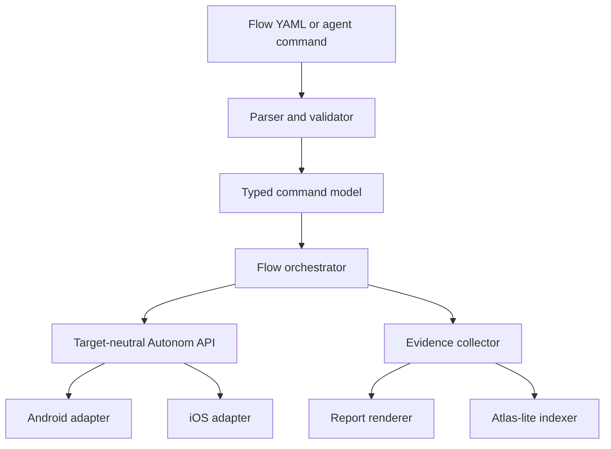

# Autonom: product and technical strategy based on Revyl and Maestro

**Status:** working specification  
**Research date:** August 15, 2026  
**Current Autonom version:** 0.15.1  
**Purpose of this document:** determine what to take from Revyl and Maestro, what not to copy, and how to turn Autonom into a useful local-first runtime, test, and evidence layer for coding agents.

---

## 1. Short conclusion

Revyl and Maestro solve different parts of the same problem.

- **Revyl** shows how to package a mobile runtime into a finished product: remote device, AI execution, reports, Atlas, Explore, and PR proof.
- **Maestro** shows how to build a simple and robust Flow DSL: readable YAML, automatic waits, selectors, subflows, hooks, tags, and CI reports.
- **Autonom** already has a strong technical core: local control of the Android Emulator and iOS Simulator, a shared UI schema, a JSON CLI, safe MITM, HAR, screenshots, recordings, logs, crashes, and portable agent skills.

Recommended direction:

> **Autonom — local-first mobile runtime and evidence layer for coding agents. It deterministically controls the application, runs repeatable flows, and stores verifiable evidence on the user's infrastructure.**

Autonom should not become a small copy of Revyl or a new full reimplementation of Maestro. It should combine:

1. the locality, transparency, and safety of the current Autonom;
2. the simple Flow UX from Maestro;
3. evidence, Atlas-lite, and PR proof from Revyl;
4. stricter semantics designed for autonomous AI agents.

The main order of work:

1. Reliable CI and test isolation.
2. Autonom Flow v1.
3. Session → Flow compiler.
4. Evidence bundle and HTML/JUnit report.
5. Atlas-lite.
6. PR Proof.
7. Explore.
8. Remote and physical-device adapters.

---

## 2. What Autonom is now

[Autonom](https://github.com/aiatsuk/autonom) is a universal mobile test and debug harness for AI coding agents.

Current deliverables:

- 23 portable `SKILL.md` skills;
- dependency-light Python CLI;
- stable machine-readable JSON API;
- support for Codex, Claude, Grok, and generic skill hosts;
- Android Emulator and iOS Simulator;
- identical core commands and a compact UI node schema on both platforms;
- accessibility-first targeting;
- screenshots as evidence, not as the sole source of control;
- no mandatory MCP and no paid vision API.

### 2.1 Already implemented

- session creation and termination;
- device inventory, boot, and shutdown;
- app install, launch, stop, and clear;
- UI tree, `find`, semantic tap, and coordinate tap;
- text input, keys, and swipe;
- screenshots with embedded provenance;
- screenshot index;
- screen recording;
- Android logcat and iOS syslog;
- Android crash buffer and iOS crash store;
- deep links;
- permissions;
- simulated location with platform-specific limitations;
- media seeding;
- safe access to the app container;
- iOS remote target via `idb companion` on another Mac;
- Android browser mirror;
- consent-gated HTTP/S interception via mitmproxy;
- response mocking;
- persistent mock rules;
- HAR 1.2 export;
- redaction before writing;
- process registry and cleanup;
- append-only `journal.ndjson`;
- Flutter, Android/Compose, and iOS skill packs.

Details: [Capabilities](https://github.com/aiatsuk/autonom/blob/main/docs/CAPABILITIES.md), [Architecture](https://github.com/aiatsuk/autonom/blob/main/docs/ARCHITECTURE.md), [Security](https://github.com/aiatsuk/autonom/blob/main/SECURITY.md).

### 2.2 Not yet present or partially implemented

- a unified Flow DSL;
- replay of a session as a test;
- a unified live stream for logs, network, and metrics;
- a combined CPU, memory, frame, and trace report;
- Flutter VM Service integration;
- React Native skill pack;
- XCUITest integration;
- Atlas or a screen graph;
- PR proof;
- a full-fledged CI release pipeline;
- tagged releases;
- optional MCP wrapper;
- a proven smoke matrix on real simulator/emulator environments.

### 2.3 Local verification result

Commit `1a0f03d53e5b68a8c5d5fa3c24255b52c2ddf4d9` was verified.

- Validation confirmed 23 skills.
- 245 Python tests passed.
- 7 Node tests passed.
- All shell and syntax checks completed successfully.

A fully temporary `HOME` had to be set for a successful run. A test-hygiene bug was found: `LifecycleBase.tearDown` in `tests/test_devices_lifecycle.py` deletes `AUTONOM_HOME` but does not restore the previous value. Subsequent tests fall back to the real `~/.autonom`. On a read-only home this produces false failures. On an ordinary developer machine the suite may touch user state.

This must be fixed before adding new subsystems. The verification used fixtures and fake drivers. It does not prove reliability on real iOS Simulator and Android Emulator.

---

## 3. What is useful in Revyl

[Revyl](https://www.revyl.com/platform/) positions itself as a mobile development platform for coding agents. It is a managed cloud product, not just a test runner.

Its full cycle:

```text
build
  → cloud simulator/emulator
  → interactive dev loop
  → test creation
  → E2E execution
  → evidence report
  → Atlas application map
  → GitHub PR proof
```

### 3.1 Strong product decisions

#### One closed loop

Revyl connects code, build, runtime, test, evidence, and pull request. The user does not assemble a separate system out of Appium, a device farm, a report portal, and CI scripts.

#### Session → Test

The user or agent first walks through the scenario on a device. Then Revyl turns the verified session into a saved test. This is far more useful than starting from an empty YAML file.

#### Git-friendly tests

Tests are described in YAML and stored in the repository. Supported are:

- AI instruction;
- validation;
- extraction;
- manual action;
- Python, JavaScript, TypeScript, and Bash steps;
- `if/else`;
- `while`;
- reusable modules;
- variables.

Sources: [Creating tests](https://docs.revyl.com/cli/tests/creating-tests), [YAML format](https://docs.revyl.com/appendix/yaml-test-format), [Step types](https://docs.revyl.com/appendix/step-types).

#### Evidence report

Revyl collects:

- video of the full run;
- a timeline of actions;
- AI summary and reasoning;
- grounding screenshots and bounds;
- iOS syslog and Android logcat;
- CPU, FPS, RSS, VSS, and memory pressure;
- Android Perfetto;
- HTTP and WebSocket waterfall;
- headers, payload, and response;
- Copy as cURL;
- shareable report links.

Source: [Reports](https://docs.revyl.com/tests/reports).

#### Atlas

Atlas builds a map of what was actually seen:

- screens;
- screen variants;
- states;
- transitions;
- covered and unknown areas.

Important: Atlas does not know the entire application. It knows only the observed paths. The documentation acknowledges empty maps, processing lag, partial runs, and auth blockers.

Sources: [Atlas](https://docs.revyl.com/atlas), [Explore](https://docs.revyl.com/atlas/explore).

#### Explore

Several agents can traverse the application in parallel using different strategies:

- balanced;
- surface sweep;
- journey focus;
- hard edges.

The main idea is useful for Autonom: exploration should leave behind a structured graph and reproducible evidence, not just a textual agent report.

#### PR Proof

The GitHub integration ties together diff, build, and runtime verification. The result includes screenshots and video proof. This turns mobile testing into part of code review.

Source: [GitHub integration](https://docs.revyl.com/integrations/github).

#### Auth and test data as part of the product

Revyl supports session preparation, variables, secrets, and ways to issue session-scoped tokens. This matters because OTP, login, seed data, and permissions often block an autonomous test run before UI automation becomes useful.

Source: [Auth and session prep](https://docs.revyl.com/cli/device/auth-and-session-prep).

### 3.2 Revyl's technical surface

- public Go CLI;
- installation via Homebrew, shell script, `pipx`, `uv`, and `pip`;
- macOS, Linux, and Windows binaries;
- `--json` output;
- Codex, Claude, and Cursor skills;
- MCP server;
- cloud builds;
- upload of prebuilt artifacts;
- remote device viewer;
- Expo and React Native hot reload;
- Flutter, native, KMP, and Bazel rebuild loop;
- generic CI and GitHub Actions;
- retries and quarantine for flaky tests.

The current public CLI release as of the research date: [v0.1.85](https://github.com/RevylAI/revyl-cli/releases/tag/v0.1.85), published on August 13, 2026.

### 3.3 Revyl's limitations

#### It is not a physical-device farm

The core infrastructure uses the iOS Simulator and the Android Emulator.

- iOS accepts a simulator `.app`;
- `.ipa` is not supported;
- Android accepts a single `.apk`;
- `.aab`, `.apks`, and split APKs are not supported.

Source: [Artifact requirements](https://docs.revyl.com/builds/artifact-requirements).

Consequently, Revyl does not verify real:

- thermal and battery effects;
- camera hardware;
- carrier network;
- OEM skins;
- Bluetooth and sensor behavior;
- physical-device performance.

#### The Flutter dev loop is weaker than React Native's

True hot reload exists for Expo and React Native. Flutter requires rebuild, upload, and reinstall. The documentation cites a typical cycle of 30–60 seconds.

Source: [Dev Loop](https://docs.revyl.com/develop/dev-loop-overview).

#### Cloud dependency

AI execution, the device backend, reports, and Atlas are SaaS. There is no fully self-hosted option.

#### Privacy and telemetry

CLI telemetry is enabled by default. It may include CLI/OS/architecture, user and organization IDs, auth/CI/agent metadata, command metadata, and a sanitized error tail. It is disabled via `REVYL_TELEMETRY_DISABLED=true` or `DO_NOT_TRACK=true`.

Sources: [analytics.go](https://github.com/RevylAI/revyl-cli/blob/main/internal/analytics/analytics.go), [Privacy](https://www.revyl.com/privacy/).

The public privacy policy does not give exact retention periods for builds, videos, logs, and network captures. It also does not disclose the full list of LLM providers, regions, and deletion SLAs.

#### Opaque CI cost

As of the research date:

- Trial: 5 hours;
- Solo: $20 per month, 1 concurrent device;
- Starter: $250 per month, 3 devices;
- Team Pro: $750 per month, 10 devices;
- overage: $0.15/min iOS and $0.12/min Android.

The number of included Solo minutes is not published. Starter and Team Pro are expressed as multiples of that unknown volume.

Source: [Pricing](https://www.revyl.com/pricing/).

### 3.4 What to take from Revyl

1. Session → Test.
2. Evidence timeline.
3. Atlas as an observed graph.
4. Explore with strategies.
5. PR proof tied to the diff.
6. Auth and test-data preparation.
7. Parallel execution and tagged suites.
8. Stability history and quarantine.
9. One clear path from code change to proof.

### 3.5 What not to take from Revyl

1. The cloud-first core architecture.
2. Mandatory vision/LLM grounding.
3. Its own device farm at an early stage.
4. Hidden telemetry by default.
5. Perpetual public report links.
6. An opaque usage model.
7. The promises of "no maintenance" and "real devices" that do not match the technical reality.

---

## 4. What Maestro offers that is useful

[Maestro](https://github.com/mobile-dev-inc/Maestro) is an Apache 2.0 UI and E2E automation framework for Android, iOS, and web. Current version as of the research date: [CLI 2.8.0](https://github.com/mobile-dev-inc/Maestro/releases/tag/cli-2.8.0).

Maestro is especially useful as a reference for the Flow DSL and execution semantics.

### 4.1 Core ideas of Maestro

#### Readable YAML

A Flow is split into two parts:

1. a configuration header;
2. a list of commands after `---`.

```yaml
appId: com.example.app
name: Login
tags:
  - smoke
env:
  USERNAME: user@example.com
---
- launchApp
- tapOn: Username
- inputText: ${USERNAME}
- tapOn: Login
- assertVisible: Welcome
```

Source: [Maestro Flows overview](https://github.com/mobile-dev-inc/maestro-docs/blob/main/flows/README.md).

#### Shorthand and expanded form

A simple command stays short:

```yaml
- tapOn: Login
```

A precise command expands into a map:

```yaml
- tapOn:
    id: login_button
    enabled: true
```

This is a good balance between hand-written and machine-generated canonical form.

#### Accessibility-first selectors

Maestro uses the accessibility tree and supports:

- `text`;
- `id`;
- `index`;
- `point`;
- state selectors;
- `above`, `below`, `leftOf`, `rightOf`;
- `childOf`, `containsChild`, `containsDescendants`;
- dimensions and traits.

Sources: [Selector guide](https://github.com/mobile-dev-inc/maestro-docs/blob/main/flows/how-to-use-selectors.md), [Core selectors](https://github.com/mobile-dev-inc/maestro-docs/blob/main/api-reference/selectors/core-selectors.md), [Relational selectors](https://github.com/mobile-dev-inc/maestro-docs/blob/main/api-reference/selectors/relational-selectors.md).

#### Assertions are expectations

`assertVisible` does not check the state just once. It polls the UI until the element appears or a timeout is reached. In Maestro the default is up to 7 seconds. For long-running processes there is `extendedWaitUntil`.

This is an important practice: a flow must not contain arbitrary `sleep` calls.

Sources: [assertVisible](https://github.com/mobile-dev-inc/maestro-docs/blob/main/api-reference/commands-available/assertvisible.md), [Wait commands](https://github.com/mobile-dev-inc/maestro-docs/blob/main/flows/flow-control-and-logic/wait-commands.md).

#### Atomic nested flows

`runFlow` reuses login, onboarding, permissions, and other small scenarios. It accepts `file`, `env`, inline `commands`, and `label`.

Maestro recommends keeping subflows atomic and separating them from end-to-end journeys.

Sources: [Nested flows](https://github.com/mobile-dev-inc/maestro-docs/blob/main/flows/flow-control-and-logic/nested-flows.md), [runFlow](https://github.com/mobile-dev-inc/maestro-docs/blob/main/api-reference/commands-available/runflow.md).

#### Conditions without a full programming language

The following are supported:

- `when.visible`;
- `when.notVisible`;
- `when.platform`;
- `when.true` via JavaScript.

The documentation specifically warns that excessive conditions make a flow complex. For substantially different scenarios, separate flows are preferable.

Source: [Conditions](https://github.com/mobile-dev-inc/maestro-docs/blob/main/flows/flow-control-and-logic/conditions.md).

#### Hooks

`onFlowStart` and `onFlowComplete` separate setup and cleanup from the main journey. The complete hook runs after pass or fail.

Source: [Hooks](https://github.com/mobile-dev-inc/maestro-docs/blob/main/flows/flow-control-and-logic/hooks.md).

#### Test discovery and tags

`config.yaml` defines glob patterns, include/exclude tags, execution order, and the output directory.

This makes it possible to keep:

- `smoke`;
- `critical`;
- `auth`;
- `pull-request`;
- `nightly`;
- `flaky`;
- platform tags.

Sources: [Test discovery and tags](https://github.com/mobile-dev-inc/maestro-docs/blob/main/flows/workspace-management/test-discovery-and-tags.md), [Workspace configuration](https://github.com/mobile-dev-inc/maestro-docs/blob/main/api-reference/workspace-configuration.md).

#### Standard reports

Maestro produces:

- JUnit XML;
- HTML;
- detailed HTML with steps;
- screenshots;
- recordings;
- logs;
- custom report properties;
- stable `junitId` and `junitClassname`.

Source: [Reports and artifacts](https://github.com/mobile-dev-inc/maestro-docs/blob/main/flows/workspace-management/test-reports-and-artifacts.md).

#### Clean separation of layers

Maestro's internal scheme:

```text
YAML Flow
  → YamlCommandReader
  → typed MaestroCommand list
  → Orchestra
  → target-neutral Maestro API
  → Android/iOS/Web driver
```

This boundary is worth replicating in Autonom: the parser and flow engine must not know the details of `adb`, `simctl`, or `idb`.

Source: [Maestro contributing architecture](https://github.com/mobile-dev-inc/Maestro/blob/main/CONTRIBUTING.md).

### 4.2 New Maestro practices in 2.7–2.8

Maestro recently improved artifacts:

- flat per-flow bundle;
- structured manifest;
- readable step names;
- a screenshot before every step;
- hierarchy on failure;
- device logs;
- crash and ANR reports.

Version 2.8 added further safety fixes:

- artifact path containment;
- refusal to write to a directory path instead of a file;
- preservation of artifacts when `onFlowComplete` fails;
- a fix for stale hierarchy in relational selectors;
- accurate timestamps and durations in reports.

Source: [Maestro changelog](https://github.com/mobile-dev-inc/Maestro/blob/main/CHANGELOG.md).

### 4.3 Maestro's shortcomings that must not be repeated

#### Regex by default

`text` and `id` are treated as regex. This is convenient, but special characters and overly broad patterns produce unexpected matches.

In Autonom the default must be `exact`. `contains` and `regex` are enabled explicitly.

#### Stateful input

`inputText` types text into the currently focused field. Such a flow depends on the success of the preceding tap. Autonom may support the Maestro form, but the canonical representation must be able to pin the target.

#### Implicit retries of mutating actions

Maestro has `retryTapIfNoChange`. It used to be applied more broadly, but was disabled by default because of side effects.

Autonom must not automatically retry tap, type, openLink, permission mutation, or network mock mutation.

Sources: [tapOn](https://github.com/mobile-dev-inc/maestro-docs/blob/main/api-reference/commands-available/tapon.md), [Changelog](https://github.com/mobile-dev-inc/Maestro/blob/main/CHANGELOG.md).

#### Retry can mask a defect

Maestro caps `maxRetries` at 3 and calls retrying a large flow an anti-pattern. Autonom must apply even stricter rules.

Source: [retry](https://github.com/mobile-dev-inc/maestro-docs/blob/main/api-reference/commands-available/retry.md).

#### JavaScript stretches the DSL too far

JS, HTTP requests, loops, and expressions turn YAML into a second programming language. This complicates determinism, sandboxing, review, and secret handling.

Autonom Flow v1 must not include a general-purpose JavaScript engine.

---

## 5. Summary comparison

| Area | Revyl | Maestro | Autonom today | Autonom target |
|---|---|---|---|---|
| Runtime | Cloud | Local or Cloud | Local and remote Mac | Local-first, provider-neutral |
| Devices | Simulator/Emulator | Simulator/Emulator/physical | Simulator/Emulator | Add physical adapters |
| Targeting | Vision/LLM + hierarchy | Accessibility selectors | Accessibility JSON | Strict typed selectors + optional vision |
| Flow DSL | Rich YAML | Mature YAML | None | Maestro-inspired strict Flow v1 |
| Replay | Yes | Yes | Journal without replay | Session → Flow → Replay |
| Evidence | Very rich cloud report | Good test bundle | Scattered artifacts | Local evidence timeline |
| App graph | Atlas | None | None | Atlas-lite |
| Exploration | Multi-agent Explore | None | Agent can act manually | Structured Explore strategies |
| PR proof | Yes | Via CI | None | Local/generated PR Proof |
| Privacy | Cloud | Local or Cloud | Local | Local by default, explicit upload |
| Agent portability | Codex/Claude/Cursor | MCP and CLI | Skills for different agents | Skills + CLI + optional MCP |
| Determinism | Partially model-dependent | Medium | High | High and verifiable |
| Security | SaaS policy | Framework-level | Explicit consent and redaction | Preserve and extend |

---

## 6. Autonom product position

### 6.1 Core statement

> **Autonom gives coding agents a deterministic mobile runtime, repeatable flows, and local evidence on infrastructure you control.**

Russian version:

> **Autonom gives coding agents a deterministic mobile runtime, repeatable scenarios, and local proof on the user's infrastructure.**

### 6.2 Who it is for

- a mobile application developer;
- a coding agent that changes UI or business logic;
- a team that cannot send artifacts to an external SaaS;
- Flutter, Android, and iOS projects;
- self-hosted CI;
- remote Macs and local device labs;
- developers of agent tools and IDE integrations.

### 6.3 Primary use case

```text
Agent changed the code
  → built the application
  → launched it on a device
  → walked through the user journey
  → verified UI, logs, network, and performance
  → saved the flow
  → replayed the flow
  → returned proof to the human
```

### 6.4 How Autonom should differ

1. Local-first, not cloud-first.
2. Accessibility-first, not vision-first.
3. Exact and typed semantics, not fuzzy behavior.
4. Agent-portable, not tied to a single IDE.
5. Evidence is part of the protocol.
6. All errors are machine-readable.
7. Dangerous actions require explicit intent.
8. Cloud and vision are adapters, not a core dependency.

---

## 7. Autonom Flow v1

### 7.1 Goals

- a human can read a flow without separate training;
- an agent can safely generate a flow;
- the parser reports an exact filename, line, column, and error code;
- a single flow works on Android and iOS when the UI semantics match;
- a repeated run has predictable semantics;
- a flow is stored in Git;
- every step is linked to evidence;
- supported Maestro flows can be imported;
- new schema versions do not silently break old flows.

### 7.2 Non-goals for v1

- a general-purpose programming language;
- arbitrary JavaScript;
- arbitrary HTTP calls;
- visual AI as a mandatory selector;
- infinite loops;
- hidden recovery after mutating failures;
- full parity with all Maestro commands;
- cloud fleet orchestration.

### 7.3 File layout

Recommended structure:

```text
.autonom/
  config.yaml
  flows/
    auth/
      login.yaml
      logout.yaml
    checkout/
      purchase.yaml
  subflows/
    prepare-session.yaml
    dismiss-permissions.yaml
  baselines/
  schemas/
```

Runtime artifacts must not end up in the repository:

```text
~/.autonom/sessions/<session-id>/
```

### 7.4 Document format

A Flow consists of a header and commands separated by `---`.

```yaml
schema: autonom.dev/flow/v1
appId: com.example.app
name: Login
tags: [smoke, auth]
---
- launchApp
- assertVisible:
    id: home_screen
```

### 7.5 Header v1

| Field | Required | Purpose |
|---|---:|---|
| `schema` | Yes | Contract version |
| `appId` | Yes for a root flow | Bundle ID or package name |
| `name` | Yes | Human-readable name |
| `id` | Recommended | Stable machine ID |
| `description` | No | Purpose of the flow |
| `tags` | No | Suite filtering |
| `properties` | No | CI and test-management metadata |
| `env` | No | Non-secret defaults |
| `requires` | No | Capabilities and platform constraints |
| `evidence` | No | Artifact collection policy |
| `onFlowStart` | No | Setup commands or a subflow |
| `onFlowComplete` | No | Cleanup commands or a subflow |

Capabilities example:

```yaml
requires:
  platform: [android, ios]
  capabilities:
    - ui.accessibility
    - logs
    - network.capture
```

The runner must verify the requirements before the first mutating action.

### 7.6 Commands v1

#### Lifecycle

- `launchApp`
- `stopApp`
- `clearState`
- `openLink`

#### UI actions

- `tapOn`
- `longPressOn`
- `doubleTapOn`
- `inputText`
- `eraseText`
- `pressKey`
- `swipe`
- `scrollUntilVisible`
- `back`

#### Assertions and waits

- `assertVisible`
- `assertNotVisible`
- `assertEnabled`
- `assertChecked`
- `waitUntil`
- `waitForIdle`

#### Device state

- `setLocation`
- `setPermissions`
- `setOrientation`
- `addMedia`

#### Composition

- `runFlow`
- `group`
- `retry`

#### Evidence

- `checkpoint`
- `takeScreenshot`
- `note`

Most evidence is collected automatically by the runner. These commands are only needed for named checkpoints and manual notes.

### 7.7 Canonical command form

A human may use shorthand:

```yaml
- tapOn: Login
```

`autonom flow fmt` converts it into the canonical form:

```yaml
- tapOn:
    selector:
      text: Login
      match: exact
    label: Tap Login
```

The canonical form is used by:

- the Session → Flow compiler;
- machine diffs;
- debugging;
- schema migrations;
- the report manifest.

### 7.8 Selectors v1

```yaml
selector:
  text: Continue
  match: exact
  enabled: true
```

Supported fields:

- `id`;
- `text`;
- `description`;
- `role`;
- `enabled`;
- `checked`;
- `focused`;
- `selected`;
- `index`;
- `above`;
- `below`;
- `leftOf`;
- `rightOf`;
- `childOf`;
- `containsChild`;
- `bounds` for diagnostics;
- `point` as a last-resort fallback.

Match modes:

- `exact` — default;
- `contains`;
- `regex`;
- `caseInsensitiveExact`.

### 7.9 Selector priority

The compiler must choose a selector in this order:

1. a stable accessibility `id`;
2. unique visible text;
3. `id + state`;
4. `text + relation`;
5. `role + relation`;
6. explicit `index`;
7. a relative point inside a stable element;
8. absolute coordinates only with a warning.

Autonom preserves its current important property: if a selector matches multiple nodes, the action is not performed without an explicit `index` or refinement.

### 7.10 Wait semantics

Hidden sleeps after every command are forbidden.

Rules:

- read and assertion commands may poll the UI;
- the default assertion timeout is set by the workspace config;
- a step may decrease or increase the timeout;
- the runner ends the wait as soon as the condition is satisfied;
- a timeout is a test failure, not an infrastructure error;
- an unreachable backend is an infrastructure error;
- `waitForIdle` is used only for animation or framework idle;
- a long backend operation uses `waitUntil` with an explicit timeout.

Example:

```yaml
- waitUntil:
    visible:
      id: payment_success
    timeoutMs: 30000
```

### 7.11 Retry semantics

Automatic retry is allowed for:

- UI tree read;
- screenshots;
- logs read;
- assertion polling;
- a transient transport error before any mutation has started.

Automatic retry is forbidden for:

- tap;
- double tap;
- input text;
- erase text;
- open link;
- permissions mutation;
- location mutation;
- mock registry mutation;
- payment-like or destructive actions.

Explicit retry:

```yaml
- retry:
    maxAttempts: 2
    onlyOn:
      - element_not_ready
    commands:
      - assertVisible:
          id: retryable_status
```

Constraints:

- a maximum of 3 attempts;
- no nested retry;
- retrying a large root flow is forbidden;
- each attempt is recorded separately in the journal and the report;
- mutating commands require `allowMutations: true` and a warning.

### 7.12 Conditions

v1 supports only a limited set:

```yaml
- runFlow:
    when:
      platform: android
      visible:
        text: Allow notifications
        match: exact
    file: ../subflows/android-permissions.yaml
```

Allowed:

- `platform`;
- `visible`;
- `notVisible`;
- `envEquals`;
- logical AND within a single `when`.

Not needed in v1:

- arbitrary expression;
- `eval`;
- unbounded `while`;
- hidden else branches.

For substantially different behavior, separate flows are created.

### 7.13 Optional steps

An optional step may be used only for external UI that does not determine the success of the scenario:

```yaml
- tapOn:
    selector:
      text: Not now
      match: exact
    optional: true
    reason: System prompt may not appear on a reused simulator
```

Requirements:

- `reason` is mandatory;
- a skipped optional step is shown in the report;
- an optional assertion is forbidden;
- an optional step cannot hide a crash or a transport failure.

### 7.14 Variables and secrets

Non-secret values may live in the header:

```yaml
env:
  LOCALE: en_US
```

Secrets are passed in only from the outside:

```bash
autonom flow run login.yaml \
  --secret TEST_EMAIL \
  --secret TEST_PASSWORD
```

Secret sources:

- process environment;
- stdin descriptor;
- OS keychain adapter;
- CI secret provider;
- a future plugin interface.

Rules:

- a flow does not store a secret value;
- the journal stores the name and the length, but not the value;
- typed text is redacted before being recorded;
- screenshots and the UI tree may contain PII, so they are marked sensitive;
- a report does not become public automatically.

### 7.15 Subflows

```yaml
- runFlow:
    file: ../subflows/login.yaml
    label: Authenticate test user
    env:
      USER_ROLE: editor
```

Rules:

- one subflow performs one task;
- the path is resolved relative to the current flow;
- path traversal beyond the workspace root is forbidden;
- recursion and cycles are forbidden;
- the root `appId` is inherited;
- a subflow may declare stricter requirements;
- arguments are validated before the run.

### 7.16 Hooks

```yaml
onFlowStart:
  - runFlow: ../subflows/prepare-session.yaml

onFlowComplete:
  - runFlow: ../subflows/cleanup-session.yaml
```

Rules:

- `onFlowComplete` runs after both pass and fail;
- a teardown failure does not overwrite the primary failure;
- both failures are preserved;
- artifacts are saved before cleanup;
- hooks are not inherited recursively by subflows;
- workspace policy may forbid mutating teardown.

### 7.17 Evidence policy

```yaml
evidence:
  mode: on-failure
  beforeMutation: true
  afterAssertion: true
  collect:
    - screenshot
    - hierarchy
    - logs
    - crashes
    - network
  bodies: preview
```

Modes:

- `minimal`;
- `on-failure` — recommended default;
- `always`;
- `custom`.

Full network bodies remain opt-in and require the existing Autonom consent.

### 7.18 Complete Flow v1 example

```yaml
schema: autonom.dev/flow/v1
id: auth-login-001
appId: com.example.app
name: Login with email
description: Verify that an existing user can reach the home screen
tags:
  - smoke
  - auth
  - pull-request

properties:
  owner: mobile-platform
  priority: critical

requires:
  platform: [android, ios]
  capabilities:
    - ui.accessibility
    - screenshots
    - logs

evidence:
  mode: always
  beforeMutation: true
  collect:
    - screenshot
    - hierarchy
    - logs
    - crashes

onFlowStart:
  - runFlow: ../../subflows/prepare-session.yaml

onFlowComplete:
  - runFlow: ../../subflows/cleanup-session.yaml

---
- launchApp:
    clearState: true

- tapOn:
    selector:
      text: Sign in
      match: exact
      enabled: true
    label: Open sign in

- tapOn:
    selector:
      id: email
    label: Focus email

- inputText:
    value: ${TEST_EMAIL}
    sensitive: true

- tapOn:
    selector:
      id: password
    label: Focus password

- inputText:
    value: ${TEST_PASSWORD}
    sensitive: true

- tapOn:
    selector:
      text: Continue
      match: exact
      enabled: true
    label: Submit credentials

- assertVisible:
    selector:
      id: home_screen
    timeoutMs: 7000

- checkpoint:
    name: logged-in
```

---

## 8. Session → Flow compiler

This is the most advantageous first product feature after the parser and runner.

### 8.1 Command

```bash
autonom flow create \
  --from-session s_123 \
  --task login \
  --out .autonom/flows/auth/login.yaml
```

### 8.2 Input data

- `journal.ndjson`;
- screenshots index;
- UI tree before the action;
- selected node and bounds;
- platform and target;
- app ID;
- logs and crash state;
- user notes;
- network checkpoints;
- successful final assertions or selected checkpoints.

### 8.3 Compiler pipeline

```text
journal
  → remove diagnostic noise
  → group low-level commands
  → resolve target node
  → choose stable selector
  → detect sensitive input
  → infer assertions from checkpoints
  → extract repeated sequence candidates
  → validate against Flow v1 schema
  → replay on same platform
  → optionally replay cross-platform
  → write canonical YAML
```

### 8.4 What the compiler must not do silently

- turn an ambiguous match into `index: 0`;
- store a password or token;
- replace a failed action with a successful-looking step;
- use absolute coordinates without a warning;
- consider a screenshot similar without an explicit visual assertion;
- add retry for a mutating action;
- consider a flow cross-platform without a second replay.

### 8.5 Quality score

The compiler can compute a score:

| Factor | Good | Bad |
|---|---|---|
| Selector | stable unique ID | absolute point |
| Match | exact | broad regex |
| Input | external secret | literal credential |
| Assertion | semantic state | no final check |
| Replay | passed twice | never replayed |
| Platform | verified both | inferred |

The score does not replace replay. It only explains the risk.

---

## 9. Evidence Bundle

Evidence must be a stable local protocol, and HTML is only one renderer.

### 9.1 Structure

```text
~/.autonom/sessions/s_123/
  session.json
  run.json
  journal.ndjson
  manifest.json
  report.html
  report.xml
  video/
    run.mp4
  steps/
    001-launch-app/
      step.json
      before.png
      after.png
      hierarchy-before.json
      hierarchy-after.json
    002-tap-sign-in/
      step.json
      before.png
      target.json
    003-input-email/
      step.json
      before.png
      target.json
  logs/
    device.log
    app.log
  crashes/
    index.json
  network/
    flows.ndjson
    capture.har
  metrics/
    samples.ndjson
    summary.json
  failure/
    error.json
    screenshot.png
    hierarchy.json
    logs.txt
```

### 9.2 `manifest.json`

```json
{
  "schema_version": 1,
  "session_id": "s_123",
  "flow_id": "auth-login-001",
  "status": "failed",
  "platform": "ios",
  "target_id": "...",
  "app_id": "com.example.app",
  "started_at": "2026-08-15T08:00:00Z",
  "finished_at": "2026-08-15T08:00:18Z",
  "primary_error": "assertion_timeout",
  "sensitive": true,
  "artifacts": [],
  "steps": []
}
```

### 9.3 Step record

Each step stores:

- stable step ID;
- source filename, line, and column;
- command type;
- canonical arguments after redaction;
- selector;
- matched node ID and bounds;
- start and end timestamps;
- duration;
- attempt number;
- result;
- warning list;
- artifact references;
- precondition and postcondition fingerprints.

### 9.4 Report views

The HTML report must have:

1. Summary.
2. Timeline.
3. Step detail.
4. Before/after screenshots.
5. Highlighted target bounds.
6. UI hierarchy diff.
7. Logs around failure.
8. Crash details.
9. Network waterfall.
10. Performance summary.
11. Environment and toolchain snapshot.
12. Reproduction command.

### 9.5 CI formats

- JUnit XML;
- compact JSON summary;
- SARIF only for code-linked findings;
- optional Markdown summary for the PR;
- stable exit codes.

---

## 10. Atlas-lite

Atlas-lite is a local observed graph. It must not be called a complete source of truth.

### 10.1 Data model

#### Screen

- `screen_id`;
- app ID;
- platform;
- normalized accessibility fingerprint;
- representative screenshot;
- stable labels and IDs;
- variants;
- first and last seen;
- source sessions;
- sensitivity.

#### Transition

- `from_screen_id`;
- `to_screen_id`;
- triggering command;
- selector;
- flow and step ID;
- success count;
- failure count;
- median duration;
- first and last seen.

#### Coverage

- screens observed;
- transitions observed;
- flows covering each node/edge;
- last successful verification;
- stale nodes after UI changes;
- unverified branches.

### 10.2 Fingerprint

The fingerprint must not depend on:

- timestamps;
- counters;
- random IDs;
- list item order, if it does not matter;
- keyboard visibility;
- system status bar values.

It must take into account:

- stable IDs;
- roles;
- important visible text classes;
- enabled/selected state;
- hierarchy shape;
- optional coarse layout zones.

### 10.3 Commands

```bash
autonom atlas update --session s_123
autonom atlas show
autonom atlas paths --from login --to checkout
autonom atlas coverage
autonom atlas diff --base main --head HEAD
```

### 10.4 Storage

```text
~/.autonom/apps/<app-id>/atlas/
  graph.json
  screens/
  transitions/
  coverage.json
```

The repository may store only an export snapshot:

```bash
autonom atlas export --out .autonom/atlas.json
```

---

## 11. PR Proof

PR Proof links the code diff and runtime evidence.

### 11.1 Pipeline

```text
git diff
  → detect affected modules/screens/routes
  → map to Atlas nodes and tagged flows
  → select smallest sufficient suite
  → build/install app
  → run flows
  → compare baseline and candidate
  → generate proof bundle
  → emit Markdown + JSON + JUnit
```

### 11.2 Command

```bash
autonom proof \
  --base main \
  --head HEAD \
  --app build/app.apk \
  --out build/autonom-proof
```

### 11.3 Result

```text
Status: PASS

Changed areas:
- Authentication form
- Home navigation

Verified:
- auth-login-001 on Android
- auth-login-001 on iOS
- home-navigation-002 on Android

Not covered:
- iOS home-navigation-002

Runtime findings:
- No new crashes
- No new error logs
- 1 new network endpoint
- Home screen median load +180 ms
```

### 11.4 Statuses

- `pass` — all required checks passed;
- `fail` — there is a confirmed failure;
- `not_covered` — no flow or platform coverage;
- `blocked` — build, auth, device, or infrastructure issue;
- `inconclusive` — the evidence is insufficient.

`blocked` or `not_covered` must never be turned into `pass`.

---

## 12. Explore

Explore runs only after Flow, Evidence, and Atlas-lite.

### 12.1 Strategies

- `surface` — open all available controls on the current screen;
- `journey` — reach a given goal;
- `edges` — permissions, offline, invalid inputs, retries, and backgrounding;
- `coverage` — traverse unknown Atlas edges;
- `change-focused` — explore areas affected by the diff;
- `performance` — repeat a path and collect metrics.

### 12.2 Safety budget

Explore receives explicit constraints:

- maximum actions;
- maximum duration;
- allowed app IDs;
- allowed deep-link schemes;
- forbidden text patterns, for example Buy or Delete;
- network capture policy;
- permission mutation policy;
- reset policy;
- allowed routes.

### 12.3 Result

Explore must return:

- new Atlas nodes and edges;
- journal;
- evidence;
- discovered failures;
- unreached goals;
- generated draft flows;
- warnings about non-deterministic selectors.

---

## 13. Architecture



### 13.1 Modules

```text
autonom_lib/
  flow/
    schema.py
    parser.py
    canonical.py
    validator.py
    commands.py
    executor.py
    conditions.py
    retry.py
    compiler.py
  evidence/
    manifest.py
    collector.py
    timeline.py
    junit.py
    html.py
  atlas/
    fingerprint.py
    graph.py
    coverage.py
    diff.py
  proof/
    git_diff.py
    selection.py
    runner.py
    summary.py
  adapters/
    android.py
    ios.py
```

### 13.2 Key boundaries

- The parser does not call device tools.
- The Flow executor does not produce HTML.
- The device adapter knows nothing about YAML.
- The Evidence collector receives structured events.
- Atlas receives only redacted normalized events.
- Agent skills use the public CLI, not internal modules.
- MCP is a wrapper over the same CLI contract.

### 13.3 Event protocol

All runtime events must share a single envelope:

```json
{
  "schema_version": 1,
  "event_id": "evt_...",
  "session_id": "s_...",
  "timestamp": "2026-08-15T08:00:00.000Z",
  "kind": "flow.step.finished",
  "platform": "ios",
  "sensitive": false,
  "payload": {}
}
```

This protocol feeds:

- `journal.ndjson`;
- live follow;
- reports;
- Atlas;
- PR Proof;
- future Runo UI;
- optional MCP.

---

## 14. CLI

### 14.1 Flow

```bash
autonom flow check <file-or-dir>
autonom flow fmt <file-or-dir>
autonom flow explain <file>
autonom flow create --from-session <id> --out <file>
autonom flow run <file-or-dir>
autonom flow list
autonom flow import <maestro-file>
autonom flow export <file> --format maestro
```

### 14.2 Run filters

```bash
autonom flow run .autonom/flows \
  --include-tag smoke \
  --exclude-tag flaky \
  --platform ios \
  --target <udid> \
  --output build/autonom
```

### 14.3 Evidence

```bash
autonom report build <session-id>
autonom report open <session-id>
autonom report export <session-id> --format html
autonom report export <session-id> --format junit
```

### 14.4 Live follow

```bash
autonom follow <session-id>
autonom logs follow
autonom network follow
autonom metrics follow
```

Every command supports `--json`. Human output goes to stderr or a separate renderer. JSON stdout stays clean.

---

## 15. Maestro compatibility

### 15.1 Recommendation

Do not claim full Maestro compatibility. Support a documented **Maestro Core Profile**.

### 15.2 Core Profile

The first profile:

- header: `appId`, `name`, `tags`, `env`;
- `launchApp`, `stopApp`, `clearState`;
- `tapOn`, `longPressOn`, `inputText`, `eraseText`;
- `swipe`, `back`, `openLink`;
- `assertVisible`, `assertNotVisible`;
- `extendedWaitUntil`;
- `takeScreenshot`;
- `runFlow`;
- basic selectors;
- `when.platform`, `when.visible`, `when.notVisible`.

### 15.3 Import behavior

```bash
autonom flow import maestro.yaml --out autonom.yaml
```

Importer:

- adds `schema`;
- makes `match` explicit;
- checks selector uniqueness during dry run;
- carries over tags and metadata;
- flags unsupported commands;
- does not execute the file when the conversion is ambiguous.

Error:

```json
{
  "ok": false,
  "error_code": "unsupported_flow_command",
  "command": "runScript",
  "file": "maestro.yaml",
  "line": 27,
  "hint": "Replace runScript with a deterministic subflow or execute it outside Flow v1"
}
```

### 15.4 Why not use the Maestro runtime directly

- Java 17 increases installation cost;
- Maestro brings its own Android and iOS drivers;
- this duplicates Autonom adapters;
- the full semantics are too broad;
- Autonom would lose its dependency-light design;
- the evidence and security model would have to be built around a foreign executor;
- Autonom needs a target-neutral protocol that also works outside E2E tests.

---

## 16. Security

Autonom's current security model is an advantage and must not be diluted.

### 16.1 Mandatory rules

- local-only by default;
- no telemetry without explicit opt-in;
- MITM on loopback only;
- physical-device proxy attachment is forbidden until there is a safe model;
- consent cannot be granted via an environment variable;
- full network bodies are opt-in;
- redaction is performed before writing;
- the CA private key is not part of session artifacts;
- app-container path traversal is forbidden;
- artifact paths are confined within the output root;
- flow subpaths are confined within the workspace;
- there is no public sharing by default;
- every upload action requires an explicit destination;
- secrets do not end up in the journal, report, or command echo;
- screenshot, video, hierarchy, and HAR are marked sensitive.

### 16.2 New threats from the Flow engine

- replay of a destructive step;
- duplicate tap;
- secret interpolation into the report;
- path traversal via `runFlow` and the screenshot path;
- recursive subflows;
- unbounded loops;
- cleanup that deletes non-test data;
- a condition that hides a failed assertion;
- an imported Maestro script with arbitrary JS;
- a report that opens remote resources;
- HTML injection via UI text or logs.

### 16.3 Mitigations

- schema validation before execution;
- dry-run capability check;
- typed command risk level;
- mutating command audit;
- no implicit mutation retry;
- output path containment;
- HTML escaping and Content Security Policy;
- no external report assets;
- bounded actions and duration;
- primary and cleanup errors are stored separately;
- imported scripts are not executed;
- secrets are passed via explicit providers.

---

## 17. Implementation plan

### Phase 0. A reliable foundation

Tasks:

- fix `AUTONOM_HOME` restoration in tests;
- add GitHub Actions;
- add Python and Node checks;
- add a macOS and Linux matrix;
- add an Android emulator smoke;
- add an iOS simulator smoke on macOS;
- add version tags and release artifacts;
- lock in the CLI compatibility policy.

Completion criteria:

- the suite does not write to the real home;
- all tests pass in a clean environment;
- two consecutive runs do not affect each other;
- the Android and iOS smokes launch the app and perform UI tree + tap + screenshot;
- the release is reproducible from a tag.

### Phase 1. Flow v1 foundation

Tasks:

- schema;
- parser;
- canonical model;
- validation errors with line/column;
- basic commands;
- selectors;
- assertions with polling;
- `runFlow`;
- tags;
- `flow check`, `fmt`, `run`;
- JSON event stream.

Completion criteria:

- one login flow passes on Android and iOS fixtures;
- an unsupported command is never ignored;
- a duplicate selector does not trigger an action;
- exact match is the default;
- a mutating command is not retried automatically;
- an invalid path is blocked before the device action.

### Phase 2. Session → Flow

Tasks:

- journal compiler;
- selector scoring;
- sensitive input extraction;
- checkpoint assertions;
- canonical YAML generation;
- same-platform replay;
- quality explanation.

Completion criteria:

- a successful manual login session turns into a flow;
- secrets do not appear in the output;
- the generated flow passes two replay runs;
- coordinate fallback is explicitly marked;
- an ambiguous selector blocks generation or requires a choice.

### Phase 3. Evidence Bundle

Tasks:

- manifest v1;
- per-step artifacts;
- failure snapshot;
- log windows;
- crash collection;
- HAR links;
- metrics summary;
- HTML detailed report;
- JUnit;
- reproduction command.

Completion criteria:

- any failed step can be explained without a re-run;
- the report does not require internet;
- report paths are confined;
- a teardown failure does not delete evidence;
- sensitive values are redacted;
- CI can open the JUnit and HTML artifacts.

### Phase 4. Atlas-lite

Tasks:

- screen fingerprint;
- variant detection;
- transition graph;
- coverage index;
- graph export;
- stale node detection;
- path query.

Completion criteria:

- a repeat visit does not create a duplicate screen;
- a meaningful UI state creates a variant;
- every edge references a session and evidence;
- the user sees observed, stale, and uncovered paths;
- Atlas does not claim the unobserved as covered.

### Phase 5. PR Proof

Tasks:

- diff reader;
- changed-area mapping;
- flow selection;
- baseline/candidate comparison;
- Markdown summary;
- JSON and JUnit outputs;
- generic CI example;
- optional GitHub Action.

Completion criteria:

- `not_covered` does not become `pass`;
- the proof contains exact flow and platform results;
- every finding leads to evidence;
- infrastructure failure is separated from product failure;
- the PR summary fits on one screen.

### Phase 6. Explore

Tasks:

- strategy interface;
- action and time budgets;
- forbidden actions;
- Atlas-aware exploration;
- draft flow generation;
- coverage report;
- multiple agents via an external orchestrator.

Completion criteria:

- Explore cannot be pushed beyond the allowed app and budget;
- every action is journaled;
- new paths are reproduced or marked non-reproducible;
- the generated flow passes the validator;
- destructive UI requires explicit policy.

### Phase 7. Providers

Tasks:

- local adapter contract;
- remote Mac adapter;
- Android host adapter;
- physical device policy;
- third-party cloud adapter interface;
- provider capability negotiation.

Completion criteria:

- a single Flow v1 does not change when the provider changes;
- an unsupported capability is detected before the run;
- artifacts are returned in a unified local format;
- cloud upload is always explicit.

---

## 18. Test strategy

### 18.1 Unit tests

- YAML parser;
- schema migrations;
- canonical formatting;
- selector matching;
- ambiguity refusal;
- condition evaluation;
- path containment;
- redaction;
- retry policy;
- screen fingerprint;
- report escaping.

### 18.2 Contract tests

- golden JSON command contract;
- golden Flow v1 schema;
- golden event envelope;
- golden manifest;
- JUnit XSD compatibility;
- stable exit codes;
- v1 flows continue to work after updates.

### 18.3 Integration tests

- fake Android and iOS adapters;
- real Android Emulator;
- real iOS Simulator;
- Flutter semantics;
- Compose IDs;
- UIKit identifiers;
- SwiftUI accessibility;
- deep links;
- permissions;
- network consent;
- crashes;
- Unicode input;
- large UI trees;
- modal hierarchy;
- orientation.

### 18.4 Reliability matrix

Every release must run the same smoke suite:

- Android current and previous API;
- iOS current and previous runtime;
- Flutter demo app;
- Compose demo app;
- UIKit or SwiftUI demo app;
- bare host without tools;
- remote iOS host.

### 18.5 Flake measurement

Critical flows are run at least 20 times in a controlled environment.

The following are counted:

- pass rate;
- assertion timeout rate;
- selector ambiguity rate;
- transport failure rate;
- median and p95 duration;
- retry count;
- evidence completeness.

---

## 19. Product metrics

### North Star

**Verified agent changes:** the share of coding agent changes for which Autonom returned a reproducible runtime proof.

### Core metrics

- time from code change to first device action;
- time from session to generated flow;
- generated flow replay success rate;
- cross-platform replay success rate;
- percent of failures explainable from first evidence bundle;
- selector ambiguity rate;
- coordinate fallback rate;
- artifact completeness rate;
- median report size;
- Atlas screen and transition coverage;
- PR Proof coverage rate;
- infrastructure versus product failure ratio;
- secret leakage incidents — target 0;
- unintended mutating retries — target 0.

### Not to be used as a primary metric

- number of AI actions;
- number of screenshots;
- number of YAML files created;
- number of Atlas nodes without verified paths;
- pass rate that ignores skipped and not-covered.

---

## 20. Key risks

| Risk | Consequence | Mitigation |
|---|---|---|
| The Flow DSL becomes a second Maestro | High maintenance cost | A constrained v1 and the importer |
| Too much AI semantics | Non-reproducible tests | Deterministic core, AI optional |
| Evidence grows quickly | Disk and privacy problems | Policies, retention, preview bodies |
| Atlas creates a false sense of coverage | Missed paths | Only the observed graph and explicit unknown |
| Retry hides bugs | False pass | No implicit mutation retry |
| Conditions turn YAML into code | Hard debugging | A constrained `when`, separate flows |
| Secrets end up in screenshots | Data leak | Sensitive marking, local-only, review tools |
| Physical devices expand the scope | Slows down the core roadmap | Provider adapter after Flow/Evidence |
| Cloud features dilute the positioning | Loss of the local-first moat | Cloud only as an optional provider |
| A compatibility promise with Maestro | A perpetual parity race | A versioned Core Profile |

---

## 21. Committed product decisions

1. Autonom stays local-first.
2. The CLI stays the source of truth.
3. MCP stays an optional wrapper.
4. Flow v1 is inspired by Maestro but has its own schema.
5. Maestro import supports only the explicit Core Profile.
6. Exact selector match is the default.
7. A duplicate match blocks the action.
8. Mutating commands are not retried automatically.
9. Assertions perform polling instead of sleeps.
10. There is no JavaScript in Flow v1.
11. Evidence is collected as a protocol, not only HTML.
12. Session → Flow is the first flagship product workflow.
13. Atlas-lite stores only the observed graph.
14. PR Proof distinguishes pass, fail, not covered, blocked, and inconclusive.
15. Explore arrives only after replay, evidence, and Atlas.
16. Cloud and physical devices are connected via providers.
17. There is no telemetry by default.
18. Any external transfer of artifacts is an explicit action.

---

## 22. Final recommendation

There is no need to compete with Revyl on the number of cloud features, and no need to reimplement all of Maestro.

What is needed is a compact, strict, well-connected product loop:

```text
Observe
  → Act
  → Verify
  → Save Flow
  → Replay
  → Build Evidence
  → Update Atlas
  → Prove Change
```

The strongest version of Autonom looks like this:

- runs locally;
- suits different coding agents;
- drives Android and iOS the same way;
- understands the accessibility tree;
- generates short, readable flows;
- does not hide ambiguity and flakes;
- leaves complete local evidence;
- shows which parts of the app have actually been verified;
- links the code diff to runtime proof;
- when needed, works on a remote Mac, a physical device, or a cloud provider without changing the flow.

This is not "yet another mobile test framework." This is a **runtime verification layer for autonomous mobile app development**.

---

## 23. Primary sources

### Autonom

- [Repository](https://github.com/aiatsuk/autonom)
- [Capabilities](https://github.com/aiatsuk/autonom/blob/main/docs/CAPABILITIES.md)
- [Architecture](https://github.com/aiatsuk/autonom/blob/main/docs/ARCHITECTURE.md)
- [Security](https://github.com/aiatsuk/autonom/blob/main/SECURITY.md)

### Revyl

- [Platform](https://www.revyl.com/platform/)
- [Introduction](https://docs.revyl.com/get-started/introduction)
- [CLI](https://docs.revyl.com/cli)
- [CLI command reference](https://docs.revyl.com/cli/command-reference)
- [Dev Loop](https://docs.revyl.com/develop/dev-loop-overview)
- [Creating tests](https://docs.revyl.com/cli/tests/creating-tests)
- [YAML test format](https://docs.revyl.com/appendix/yaml-test-format)
- [Step types](https://docs.revyl.com/appendix/step-types)
- [Reports](https://docs.revyl.com/tests/reports)
- [Atlas](https://docs.revyl.com/atlas)
- [Explore](https://docs.revyl.com/atlas/explore)
- [GitHub integration](https://docs.revyl.com/integrations/github)
- [MCP setup](https://docs.revyl.com/integrations/mcp-setup)
- [Artifact requirements](https://docs.revyl.com/builds/artifact-requirements)
- [Pricing](https://www.revyl.com/pricing/)
- [Privacy](https://www.revyl.com/privacy/)
- [CLI repository](https://github.com/RevylAI/revyl-cli)
- [CLI releases](https://github.com/RevylAI/revyl-cli/releases)

### Maestro

- [Repository](https://github.com/mobile-dev-inc/Maestro)
- [Documentation repository](https://github.com/mobile-dev-inc/maestro-docs)
- [Flows overview](https://github.com/mobile-dev-inc/maestro-docs/blob/main/flows/README.md)
- [Selector guide](https://github.com/mobile-dev-inc/maestro-docs/blob/main/flows/how-to-use-selectors.md)
- [Core selectors](https://github.com/mobile-dev-inc/maestro-docs/blob/main/api-reference/selectors/core-selectors.md)
- [Relational selectors](https://github.com/mobile-dev-inc/maestro-docs/blob/main/api-reference/selectors/relational-selectors.md)
- [Nested flows](https://github.com/mobile-dev-inc/maestro-docs/blob/main/flows/flow-control-and-logic/nested-flows.md)
- [Conditions](https://github.com/mobile-dev-inc/maestro-docs/blob/main/flows/flow-control-and-logic/conditions.md)
- [Hooks](https://github.com/mobile-dev-inc/maestro-docs/blob/main/flows/flow-control-and-logic/hooks.md)
- [Wait commands](https://github.com/mobile-dev-inc/maestro-docs/blob/main/flows/flow-control-and-logic/wait-commands.md)
- [Retry](https://github.com/mobile-dev-inc/maestro-docs/blob/main/api-reference/commands-available/retry.md)
- [Test discovery and tags](https://github.com/mobile-dev-inc/maestro-docs/blob/main/flows/workspace-management/test-discovery-and-tags.md)
- [Reports and artifacts](https://github.com/mobile-dev-inc/maestro-docs/blob/main/flows/workspace-management/test-reports-and-artifacts.md)
- [Workspace configuration](https://github.com/mobile-dev-inc/maestro-docs/blob/main/api-reference/workspace-configuration.md)
- [Architecture notes](https://github.com/mobile-dev-inc/Maestro/blob/main/CONTRIBUTING.md)
- [Changelog](https://github.com/mobile-dev-inc/Maestro/blob/main/CHANGELOG.md)
- [CLI releases](https://github.com/mobile-dev-inc/Maestro/releases)
