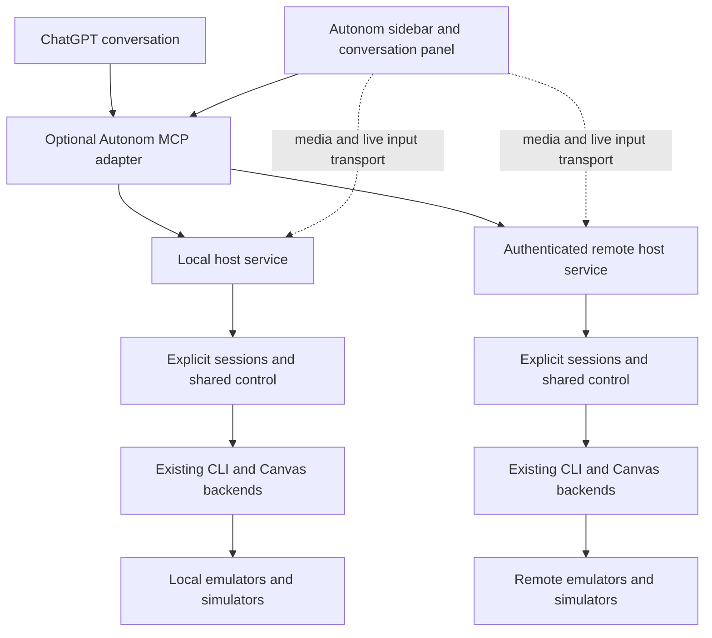

# Autonom device workspace for ChatGPT desktop

Status: proposed implementation plan; no runtime changes implemented.
Research date: 2026-10-07.
Code baseline: `66b6375a3296ef8f463de51b7c134cfe0af9e533` (Autonom 0.34.0).

## Outcome and scope

Open Autonom from ChatGPT's sidebar, see local and remote Android emulators
and iOS simulators together, control a selected device manually or through
chat, and run a flow across selected devices with separate evidence.
The same workspace should open beside a conversation.

The user explicitly wants both locally launched Canvas sessions and remote
connections by URL. Both are first-class requirements. Initial implementation
should favor a private deployment; public directory distribution is a later
milestone. Remote transport preference is still open: this plan provisionally
starts with an authenticated private tunnel and also requires an HTTPS URL
attachment path. A plain browser URL and a fully capable remote Autonom host
may expose different capabilities; the UI must show that difference.

Working hypothesis: retain the CLI and existing device transports, add explicit
concurrent sessions and shared control enforcement, then build an optional MCP
adapter and MCP App UI. Test the desktop host's command and media paths before
committing to the transport or deployment design.

The first useful milestone is one local Android emulator and one remote iOS
simulator in the same ChatGPT workspace: live screens, independent input,
correct chat targeting, human takeover, and separate journals. Also test two
devices on one host; a two-host demonstration alone misses the current session
store limitation.

Non-goals for the first release: a hosted device farm, team scheduling and
billing, physical production devices, arbitrary remote shell access, identical
gesture support across platforms, and new network interception features.
Existing consent requirements for network capture remain in force.

## Current implementation and gaps

These findings come from source inspection, not a live device demonstration.
Paths are relative to the repository root; symbols are included so findings
remain locatable after line numbers move.

| Area | Verified code | Consequence for the plan |
| --- | --- | --- |
| Plugin package | `plugins/autonom/.codex-plugin/plugin.json`, `plugins/autonom/.claude-plugin/plugin.json`, and `plugins/autonom/README.md`: 24 skills; separately installed CLI; no declared MCP server | Extend the existing plugin identity and retain portable skills. MCP and UI are new optional components. |
| Session creation | `scripts/autonom.py::cmd_session_start` refuses a second session with `session_already_active`; `tests/test_cli_hardening.py::SessionStartTests` asserts this | Multiple active device sessions require a core change, not only a device grid. |
| Explicit selection | `scripts/autonom_lib/session.py::select/load_by_id/load_current/save` and `scripts/autonom.py::_select_session` support `--session-id`; records live under the machine store | Reuse explicit IDs and stopped-session guards. `current.json` must become a convenience pointer, not the active-session registry. |
| Canvas startup | `scripts/autonom.py::cmd_canvas_serve` starts one supervised Node process for one explicit target and port; process ownership follows the matching selected/current session | Add stable session binding, discovery, and port allocation for multiple Canvas instances. |
| Canvas evidence | `scripts/autonom_canvas_bridge.py::parser/journal_session/dispatch` has target flags but no session selector; it loads the current session on each action and records only if the target matches | Bind the child bridge to its session. Otherwise a second device can act without evidence even though wrong-device journaling is avoided. A parent ContextVar does not cross the subprocess boundary. |
| Video and input | `plugins/autonom/skills/android-emulator-browser/scripts/android-emulator-browser.mjs`, `scrcpy-session.mjs`, and `docs/ARCHITECTURE.md` implement Android scrcpy and iOS idb streaming plus fallbacks | Reuse capture, decoders, geometry handling, input validation, backpressure, and transport diagnostics. Extract reusable UI pieces instead of duplicating the large page script. |
| Control ownership | Node `refusal/applyControl` uses process-local `controlOwner/inputPaused`; CLI device handlers have separate actuator paths | Canvas takeover does not establish a host-wide lease for CLI/flow/MCP operations. Introduce shared enforcement before promising exclusive human/agent control. |
| Remote reachability | Node `server.listen`, `handleRequest`, and `authorize` bind to loopback and validate Host/auth; the Canvas skill documents forwarding with a matching localhost port | Forwarded remote use is compatible with the current model. General HTTPS URL onboarding, version negotiation, and a remote host API are not implemented in these inspected paths. Existing user deployments must be tested, not assumed absent. |
| Embedding | Node `handleRequest/sendHtml` refuses framed loads and sends `frame-ancestors 'none'` plus `X-Frame-Options: DENY`; WebSockets validate origins | A browser-working Canvas URL cannot simply be placed in the plugin iframe. Add an explicit plugin transport/UI mode; retain standalone protections. |
| Cleanup and evidence | `scripts/autonom_lib/processes.py` tracks ownership and checks process identity; `session.py::save/stop_session` guards stop races; `actions.py::record_detail` uses a count-based filename and best-effort writes | Preserve scoped cleanup and stopped-session immutability. Make evidence allocation concurrency-safe and surface recording failures without retrying device input. |
| Existing validation | `scripts/run_checks.sh`, `tests/run_parallel.py`, Python Canvas/CLI tests, `tests/browser-bridge.test.mjs`, `tests/browser-scrcpy.test.mjs`, and `tests/live/canvas_*_live.mjs` | Extend these contracts and fixtures; add explicit mixed-host and in-ChatGPT acceptance tests. Existing Canvas tests do not establish plugin compatibility. |

## What the ChatGPT platform establishes

Official documentation checked on the research date:

- Sidebar (`global`) and conversation-panel (`thread`) entrypoints, plus
  model/app context sharing, are documented extension points.
  [Plugin extensions](https://developers.openai.com/plugins/build/extensions).
- UI resources use the MCP Apps bridge. Prefer this portable bridge and
  feature-detect host extensions.
  [ChatGPT UI](https://developers.openai.com/plugins/build/chatgpt-ui).
- Components declare connection/resource origins; nested frames have separate
  constraints. These declarations alone do not prove localhost or video works.
  [UI reference](https://developers.openai.com/plugins/reference).
- Local plugin testing is documented. Portable root manifests and MCP config
  coexist with supported compatibility manifests; this is not evidence that
  every ChatGPT surface launches arbitrary local server processes.
  [Packaging](https://developers.openai.com/plugins/build/plugins).
- Secure MCP Tunnel is an option for private MCP connectivity, with separate
  Platform/workspace access and runtime credentials. Treat it as a command
  transport; do not assume it carries arbitrary browser video WebSockets.
  [Secure MCP Tunnel](https://developers.openai.com/api/docs/guides/secure-mcp-tunnels).
- Public MCP plugin submission currently needs a stable public HTTPS endpoint;
  a private tunnel by itself does not qualify.
  [MCP deployment](https://developers.openai.com/plugins/build/mcp-server).

Still unverified: account-specific availability, local bundled MCP behavior
in the intended ChatGPT mode, loopback access from the UI sandbox, video
decoding and WebSocket support there, permitted dynamic remote origins,
background panel behavior, and install/update behavior of the completed bundle.
P0 must record the actual desktop build, OS, account surface, and test results.

## Target architecture



The media arrows describe logical paths. P0 chooses direct authenticated
transport or a relay at an allowed origin; neither route is assumed to work
inside ChatGPT today. High-rate frames and pointer events must not become
one model tool call per event. MCP handles semantic actions, discovery, runs,
and evidence. Both paths enforce the same session identity and control lease.

Keep the dependency-free CLI usable on its own. Isolate SDK/build dependencies
in the optional adapter/UI package. Proposed source locations, not existing
APIs: `integrations/chatgpt/` for MCP/UI, and focused modules under
`scripts/autonom_lib/` for session registry, control, and host operations.
Continue using the existing Canvas transport modules. Pick a packaging layout
in P0 and update release bundling/validation with it; do not impose an npm
install on existing CLI or skills-only users.

### Identity, attachment, and lifecycle

Use a stable `host_id`, a target key `(host_id, platform, target_id)`, and a
session reference `(host_id, session_id)`. Device labels and URLs are display
and connection data, never identity. Duplicate emulator serials on two hosts
must not collide. Every action, stream, run, and artifact carries its session.

Local onboarding discovers devices through the host service and can boot/start
an explicitly selected target. Remote onboarding accepts a user-provided URL,
authenticates, negotiates protocol/capabilities, and resolves host/session IDs.
Store credential references separately; never put bearer URLs or credentials
into model context, ordinary logs, or persisted UI state.

Support two remote cases deliberately:

| Remote endpoint | Experience |
| --- | --- |
| Versioned Autonom host service | Discover sessions, start authorized sessions, use semantic tools, stream Canvas, and retrieve evidence according to advertised capabilities. |
| Existing standalone Canvas URL | Attach the screen/control capabilities it actually exposes. Missing host/session/semantic APIs are shown as unavailable. Require a host adapter for full flows and evidence; do not infer these from a visible screen. |

Implement an explicit legacy Canvas handshake/adapter in P3. For an arbitrary
HTTPS deployment, confirm proxy routing, WebSocket upgrades, auth, and version
using a representative endpoint before declaring support. Do not strip Host
or Origin protections indiscriminately or assume all remote URLs share a
protocol. User-supplied attachment URLs must not turn a hosted relay into an
unrestricted fetch proxy; validate schemes, destinations, redirects, and the
principal's allowed host connections.

Distinguish **detach view**, **stop this session**, and **shut down device**.
Closing ChatGPT or a panel detaches viewing/control and leaves the session
running unless the user requested stop. Stopping a session cancels its jobs,
releases input, and reaps only its verified owned processes. Reconnection
resolves the original host/session; it never silently substitutes a device.

### Session and control contracts

Allow active sessions on different targets in one machine store. Enforce one
mutating session owner per target with atomic registry updates and locking.
Keep legacy single-session CLI behavior where unambiguous; require explicit
selection when multiple sessions could be meant. New plugin requests always
name a session and never depend on the machine's current pointer.

Pass the binding to Canvas, its Python bridge, flow children, log capture, and
all other workers. Audit paths, mocks, ports, process ownership, teardown, and
record saves for shared-state assumptions. Do not implement multi-device
support by silently creating a separate `AUTONOM_HOME` per device: that also
splits process and mock registries and obscures ownership/cleanup.

The host is authoritative for control. A lease has an owner identity, role,
expiry, and increasing generation. Client-provided `origin: agent|human` is
attribution, not authorization. All managed mutation routes (CLI, flow, MCP,
Canvas HTTP, scrcpy/idb live input) check ownership and generation at execution.
Unmanaged direct adb/simctl commands are outside this guarantee.

Human takeover pauses an agent run, rejects stale queued input, and releases
held keys/pointers. Lease loss, reconnect, and pause cannot silently resume
an interrupted mutation. Use an operation ID to reconcile uncertain results;
never replay a tap or install automatically after a timeout. Read-only viewers
can remain attached while one controller holds a lease.

### MCP and UI contract draft

Names below are design proposals, not commands available in 0.34.0.

| Tools | Minimum behavior |
| --- | --- |
| `list_hosts`, `list_devices`, `list_sessions`, `get_session` | Return authorized identities, capability/version information, and connection state; one offline host does not hide healthy hosts. |
| `start_session`, `stop_session`, `open_workspace` | Select explicit targets, distinguish attach/start, and return stable session references. |
| `get_screen`, `get_ui_tree`, `tap_element`, `type_text`, `press_key` | Reuse existing CLI semantics and evidence; require session and valid control for writes. Sensitive text stays out of stored summaries. |
| `acquire_control`, `release_control`, `pause_session` | Share authority with manual Canvas input and flow execution. |
| `start_flow_run`, `get_run`, `cancel_run`, `get_artifact` | Return a job/run ID promptly, report each session independently, and serve authorized evidence by ID rather than arbitrary filesystem path. |

Use explicit JSON schemas for success and error results. Preserve the existing
CLI `ok`, `error_code`, `error`, `hint`, and applicable extra fields such as
`capability`, session/target identity, and UI provenance. Add adapter-level
`schema_version`, host/session reference, `operation_id`, status, and evidence
references. Distinguish rejected, completed, and outcome-unknown mutations.
Define how MCP `isError` maps to failure variants without violating output
schemas. Round-trip test every field consumed by UI or orchestration.

The adapter invokes allowlisted CLI operations with argument arrays and
explicit session IDs. Avoid calling `autonom.main()` concurrently inside an
MCP process: the current CLI has module-global result/parser state and tool
overrides. Bounded subprocesses preserve its interface; a later service API
can replace them only with demonstrated equivalence. Long runs need supervised
jobs with cancellation and durable status, not an unbounded blocking call.

The UI shows devices by host, connection state, active session, selected
controller, and measured stream health. Selection is conversation-scoped;
send stable session references and selection revision through model context.
An action resolves that selection once; a later UI click cannot retarget it.
Display capabilities instead of offering buttons that cannot work on iOS.
Use reduced-rate thumbnails for the grid and a higher-rate focused stream;
measure resource use before choosing default device counts or frame rates.

### Runs and evidence

Run the same flow semantically on each selected device, with platform-specific
selectors where needed. Do not broadcast screen coordinates between devices.
Set bounded concurrency per host and a serial mutation queue per session.
Keep per-device statuses: pending, running, passed, failed, cancelled,
disconnected, or outcome unknown. Aggregate results retain successes and
partial evidence even if one host or parser fails.

Session journals, screenshots, trees, logs, flow events, and reports remain
the evidence source. Give artifacts stable authorized IDs and bounded reads;
stream disconnect is distinct from device failure. Make detail filenames
collision-safe, preserve record fields across concurrent saves, and record
evidence-write failures as warnings. A visual comparison uses equivalent flow
steps and normalized device state; a raw screenshot difference is not by
itself a functional failure.

## Implementation sequence and gates

Each phase should land as bounded changes with its own tests. Before independent
review, run targeted interface/error tests, then the separate read-only
error-path review required by the working rules. Fix its findings before the
independent review. Runtime evidence is required at the integration gates.

| Phase | Work and main code areas | Exit gate |
| --- | --- | --- |
| **P0: desktop feasibility** | Disposable plugin using a fake host first; verify sidebar/thread entrypoints, MCP reads/writes, model context, actual runtime location, authentication, media reachability, decoder, and reconnect. Test local and remote routes separately. | A checked-in capability matrix and transport decision with desktop screenshots/logs. Prove at least one viable authenticated command path and one media path for each locality. An external-browser fallback is useful but does not pass the embedded workspace gate. |
| **P1: concurrent sessions** | `session.py`, CLI start/select/stop, platform resolution, process registry, artifacts/mocks/ports, bridge binding, and session schema migration. Add session list/select semantics and atomic per-target ownership. | Two targets on one host run independently; start/start and stop/save races tested; commands and artifacts never cross targets; old fixtures migrate and stopped sessions remain readable. |
| **P2: shared control** | Host-wide leases and mutation admission across CLI, flow, Canvas HTTP and both streamed input backends. Unique evidence records and cancellation reconciliation. | Human takeover stops further managed agent mutations; stale queues cannot execute after takeover; dropped clients release input; two controllers cannot own one session. |
| **P3: host and MCP adapters** | Optional host API and ChatGPT adapter, URL attachment/legacy capability handshake, session operations, bounded jobs, auth, errors, and artifact delivery. Preserve CLI contracts. | MCP Inspector plus adapter tests exercise success, refusal, timeout, malformed output, partial collection, cancellation, and lost responses. Remote URLs and host identities cannot be used to read another session's data. |
| **P4: workspace UI** | Extract reusable Canvas rendering/transport/input code; add device grid, focus view, local/URL onboarding, sidebar/thread entrypoints, context synchronization, and stream diagnostics. | In ChatGPT: local Android plus remote iOS, manual and chat actions on each, takeover, panel reopen, host reconnect, and evidence links. Standalone Canvas regression tests still pass. |
| **P5: multiple-device runs** | Host scheduler, per-session mutation queues, per-device progress/cancel, and aggregate evidence/comparison. Reuse Flow v1. | One flow on two same-host devices and a mixed-host pair; one fails/disconnects while the other completes; cancellation and uncertain actions are reported accurately. |
| **P6: packaging and delivery** | Existing plugin manifests/marketplaces, optional adapter build/install/update, validator, release archive, skills/docs, version negotiation, and rollback. Private installation first; public distribution is a separate deployment choice. | Clean install of the packaged copy, then the full real smoke flow through that installed copy. No release claim based only on checkout tests. |

Dependency order: P0 → P1 → P2 → P3 → P4 → P5 → P6.
P0 may use disposable fake-session scaffolding to prove host APIs without
implementing P1–P3. Do not ship that scaffold as the product's session model.
Do not widen production UI work if P0 has not found a supported media path.
The exact direct/tunnel/relay topology and estimates are decided after P0;
there is no delivery-date commitment in this plan.

Split implementation checkpoints by phase/task. Work expected to exceed about
45 minutes needs a checkpoint containing branch/base, completed gates, commands,
evidence paths, and the next task. Keep individual commands/agent jobs below
the 3600-second cap; use the user's longjob workflow for unattended chunks.

## Verification matrix

| Concern | Required test/evidence |
| --- | --- |
| Identity | Same Android serial on two hosts; duplicate labels; stale selection; unknown host; platform/session mismatch; no implicit default from plugin calls. |
| Concurrency | Simultaneous session starts on same/different devices; concurrent detail writes; pointer changes during Canvas input; stop/save race; multiple views of one session. |
| Error contracts | Missing optional fields, malformed/partial responses, unsupported capabilities, backend exception, timeout after input, failed auth, stopped/stopping session, and unknown protocol version. Success and failure round trips preserve all consumed fields. |
| Remote transport | Local loopback, private forwarded endpoint, authenticated HTTPS URL, lost tunnel, expired/revoked auth, redirects, WebSocket interruption, blocked origin, and absent full host API. Command success and media success recorded separately. |
| Control | Human takeover during a flow and held gesture, lease expiry, two agents, queued commands after pause, reconnect with old generation, and attempted role spoofing. No automatic repetition of uncertain input. |
| Lifecycle | Detach/reopen versus stop; device disappears; host restart; process PID reused; partial teardown; one session stops while another continues. |
| Evidence | Each input attributable to one session; no secrets in logs/context; evidence-write warnings; partial aggregate results; artifact permissions; old sessions readable after migration. |
| UX/performance | One/two/four previews on documented hardware, focused stream latency/FPS, CPU/memory/bandwidth, background behavior, reconnect, keyboard focus, iOS geometry, and unavailable capabilities. Record baseline in P0/P4 before setting regression thresholds. |
| Compatibility | CLI-only, existing skills-only install, standalone Canvas, MCP without UI, old/new host version mismatch, and packaged plugin update/rollback. |

Start from the existing test entrypoints:

```bash
python3 scripts/validate_plugin.py .
python3 tests/run_parallel.py test_cli_hardening test_canvas_scrcpy
node --test tests/browser-bridge.test.mjs tests/browser-scrcpy.test.mjs
./scripts/run_checks.sh
```

Run targeted tests when their area changes, then the repository-required full
gate before committing. The runner isolates `AUTONOM_HOME`; new tests that
change environment variables must use `tests/env_isolation.py`. Inspect the
live scripts' usage before running them and always select explicit fixture
devices. Do not change host proxy, certificates, or Xcode settings for a test.

Required final smoke: install the built plugin, attach local Android and remote
iOS, select each in turn, inspect then change fixture state by chat and manual
input, verify before/after screen/tree evidence, exercise takeover, run a flow,
disconnect/reconnect one host, inspect separate reports, and stop only owned
sessions. Report each route as pass/fail/not exercised; unit tests cannot mark
this smoke complete.

## Decisions and next action

Decided for this plan: reuse Autonom's device backends; keep CLI/skills portable;
support both local and URL attachment; require explicit session identity;
separate high-rate media from model calls; deliver a private prototype first.

Open decisions with owners/checkpoints:

| Decision | When/how resolved |
| --- | --- |
| Exact ChatGPT runtime and permitted local MCP path | P0 desktop experiment; record product mode/account availability. |
| Local and remote media route, including dynamic origins | P0 actual sandbox test; choose an authenticated allowed-origin relay only if required. |
| First remote deployment to validate | User preference or private-tunnel default; obtain a representative authorized host/URL for the later live test. |
| SDK language/build packaging | P0 spike; favor an isolated TypeScript MCP/UI integration with Python core unchanged, subject to verified host packaging. |
| Public distribution topology | After private acceptance; choose and cost a stable endpoint/relay deployment if public submission is wanted. |
| Performance targets and supported concurrency | Measurements on declared hardware and networks in P0/P4. |

Next implementation task: **P0, prove the desktop host contract**. Its deliverable
is a small installable experiment and an evidence-backed decision document,
not the finished dashboard. This planning change itself does not install a
plugin, start devices, create tunnels, or publish anything.

P0 task checklist:

1. Record the intended desktop build/mode and inspect the current extension
   SDK and plugin packaging examples. Verify local-server support in that mode.
2. Install a private experiment with one read tool, one harmless fake-state
   write tool, one UI resource, and global/thread entrypoints.
3. Verify model-to-tool, UI-to-tool, and selection-to-model round trips, including
   an error response and a stale selection.
4. Connect a synthetic video/input endpoint locally and through the intended
   remote route. Record CSP/auth/WebSocket/decoder behavior and disconnection.
5. After synthetic checks pass, verify one explicit fixture target over each
   route. Keep current sessions isolated until P1 exists; do not disable the
   one-session guard to make the demonstration pass.
6. Save a pass/fail/not-exercised matrix, screenshots/logs, chosen topology,
   installation requirements, and revised implementation estimates. If a route
   is unsupported, identify the required relay or host capability before P1.
